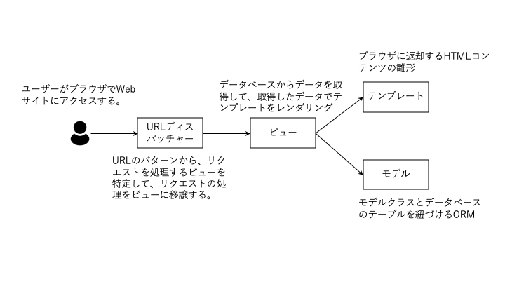

# Djangoとは

- [Djangoとは](#djangoとは)
  - [HTML、CSSおよびJavaScriptとは](#htmlcssおよびjavascriptとは)
  - [Djangoのプロジェクトとアプリ](#djangoのプロジェクトとアプリ)
    - [Djangoのプロジェクトとは](#djangoのプロジェクトとは)
    - [Djangoのアプリとは](#djangoのアプリとは)
  - [本チュートリアルで提示するソースコードについて](#本チュートリアルで提示するソースコードについて)
  - [まとめ](#まとめ)

[Django](https://www.djangoproject.com/)は、PythonでWebアプリケーションを開発するときに利用される、Webアプリケーション開発フレームワークの1つです。
Djangoはフルスタックで、Webアプリケーションの開発に必要なほとんどの機能を提供しています。

Djangoを使用することで、例えばサイボウズなどログインしたユーザーに合わせたWebページを動的に生成して、配信できます。

> フレームワークとは「枠組み」を意味します。
> Webアプリケーション開発フレームワークは、開発者がその「枠組み」に従うことで、Webアプリケーションの開発を作業を支援します。

Djangoは、主に以下の機能を持っています。

- MVCモデルのサポート
  - Model-View-Controller（MVC）アーキテクチャを採用しており、モデル、ビュー及びコントローラにコンポーネントを分割します。
    - モデルは、アプリケーションで扱われるデータで、ビジネスロジックを表現します。
    - ビューは、モデルをユーザーに提示するためにHTMLなどに変換します。
    - コントローラーは、ユーザーからの入力をアプリケーションに反映するために、ビューとモデルを橋渡しします。
  - ただし、Djangoは、MVCではなくModel-View-Template (MVT)と表現しています。
    - モデルの役目はMVCと同様です。
    - ビューは、ユーザーからの入力を処理する役目を担います（MVCのコントローラーに近い）。
    - テンプレートは、HTMLなどのテキストの雛形を定義したもので、ビューがレンプレートをレンダリングすることでHTMLなどを生成します。
- データベースサポート
  - 複数のデータベースをサポートしており、モデルとデータベースを紐付けします。
  - モデルを定義すると、マイグレーションと呼ばれる機能により、モデルを表現するテーブルがデータベースに作成されます。
    モデルに定義したモデルフィールドは、そのテーブルのカラムと対応します。
    また、モデルを変更した後にマイグレーションすると、変更内容がモデルと対応するテーブルに反映され、モデルを削除するとテーブルが削除されます。
- ORM (Object-Relational Mapping)
  - モデルインスタンスとデータベースを紐付けします。
    - モデルとモデルインスタンスは、概念と実態に対応して、`書籍`という概念が実体化して`Fluent Python`など現実の書籍になります。
  - データベースを操作するSQLを実装することなく、モデルやモデルインスタンスを操作することで、データベースのデータを検索、参照、登録、更新及び削除などできます。
- ルーティング
  - リクエストされたURL（`リクエストURL`）により、そのリクエストを処理するビューにリクエストを割り当て（`ディスパッチ`）ます。
- フォーム処理
  - フォームは、Webページでユーザーがデータを入力するHTMLの要素です。
  - フォームに入力されたデータは、Webアプリケーションに送信されます。
  - Djangoは、フォーム処理を支援する機能があり、フォームの作成、HTML要素にレンダリング及び入力データの検証などを自動化します。
- ユーザー管理
  - 認証や認可に関する機能を提供しており、ユーザーの作成、ログイン、ログアウト及びパスワードリセット機能などを容易に実装できます。
- 管理サイト
  - 管理サイトを提供しており、定義したモデルを管理サイトに登録することで、そのモデルインスタンスを参照、登録、更新及び削除するWebページを提供します。
- セキュア（安全性）
  - Djangoはセキュリティに配慮したフレームワークで、クロスサイトリクエストフォージェリ（CSRF）、SQLインジェクション、XSS（クロスサイトスクリプティング）などの攻撃から保護または回避する機能を提供します。
- 地理空間情報
  - Djangoで地理空間情報を扱う[GeoDjango](https://docs.djangoproject.com/en/4.2/ref/contrib/gis/)を提供します。
- Pythonエコシステム
  - Pythonで開発するため、[PyPI (Python Package Index)](https://pypi.org/)が提供する多種多様で膨大なパッケージを利用できます。



## HTML、CSSおよびJavaScriptとは

`HTML`は、ドキュメントを記述するための`マークアップ`言語です。
ここで、マークアップとは、文章などに対して、章や段落などの`意味`を付けることです。

`CSS`とは、HTMLに記述された文章などに対して、赤色で文字を表示するなど装飾するための言語です。

`JavaScript`とは、主にブラウザで動作するプログララミング言語で、Webページの内容を変更するときなどに利用します。

通常、WebサイトはHTML、CSSそしてJavaScriptで構成されます。

## Djangoのプロジェクトとアプリ

### Djangoのプロジェクトとは

Djangoのプロジェクトは、すべてのDjangoのアプリを管理するもので、Webアプリケーション全体に対応します。
プロジェクトは、設定情報や、CSS、JavaScript、画像などブラウザに送信する静的なファイルなど、プロジェクト全体で扱うコンテンツを管理します。

### Djangoのアプリとは

Djangoのアプリは、Webアプリケーションが提供する機能の一部を再利用可能な形でまとめたものです。
プロジェクトは1つ以上のアプリで構成され、例えば、ショッピングサイトのプロジェクトを以下の複数のアプリで構成することが考えられます。

```text
ショッピングサイトプロジェクト
├── 顧客管理アプリ
├── 顧客認証アプリ
├── 商品管理アプリ
├── 在庫管理アプリ
├── 注文管理アプリ
├── 入金管理アプリ
└── 配送管理アプリ
```

> Djangoのアプリは、一般的なアプリケーション（アプリ）とは概念が異なります。

## 本チュートリアルで提示するソースコードについて

本チュートリアルでは2つの方法でソースコードを提示します。

1つめは、既存のソースコードを変更せずに、提示したコードでファイルをすべて入れ替えるか、提示したコードを単に追加する方法です。
これらは、提示したソースコードのすべての行について先頭に`+`や`-`がないソースコードです。
次に例を示します。

```python
def fibonacci(seq):
    if seq <= 1:
        return seq
    return(fibonacci(seq-1) + fibonacci(seq-2))
```

2つめは、既存のソースコードの実装を変更する方法です。
提示したコード内に、先頭に`+`がついている行は、ソースコードに追加する行です。
逆に、本チュートリアルのコード例で、先頭に`-`がついている行は、ソースコードから削除する行です。
また、先頭がブランクな行は、当該部分を変更していないことを示しています。
この方法でソースコードを変更するコード例は、2スペース分インデントされています。

```python
  def fibonacci(seq):
      if seq <= 1:
          return seq
-     return(fibonacci(seq-1) + fibonacci(seq-2))
+     return fibonacci(seq-1) + fibonacci(seq-2)
```

上記コードは、現在の`fibonacci`関数の`return`文（行の先頭が`-`）を削除して、新たに行の先頭が`+`の`return`文を追加します。

## まとめ

本章では、Djangoの概要について説明しました。

次の章では、Djangoのプロジェクトを作成して、開発環境を整備します。
