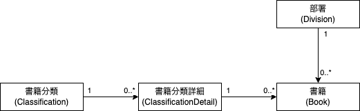

# Djangoのインストールとプロジェクト構築

- [Djangoのインストールとプロジェクト構築](#djangoのインストールとプロジェクト構築)
  - [書籍アプリケーション](#書籍アプリケーション)
  - [Djangoのインストールとプロジェクトの構築](#djangoのインストールとプロジェクトの構築)
    - [./book\_managementディレクトリ](#book_managementディレクトリ)
    - [./book\_management/__init__.pyファイル](#book_managementinitpyファイル)
    - [./book\_management/asgi.pyファイル](#book_managementasgipyファイル)
    - [./book\_management/settings.pyファイル](#book_managementsettingspyファイル)
    - [./book\_management/urls.pyファイル](#book_managementurlspyファイル)
    - [./book\_management/wsgi.pyファイル](#book_managementwsgipyファイル)
  - [リンター及びフォーマッターの設定](#リンター及びフォーマッターの設定)
  - [プロジェクトのコミット](#プロジェクトのコミット)
  - [開発用サーバーの起動](#開発用サーバーの起動)
  - [プロジェクトの日本語化とタイムゾーンの設定](#プロジェクトの日本語化とタイムゾーンの設定)
  - [データベースの準備](#データベースの準備)
  - [Django Debug Toolbarの導入](#django-debug-toolbarの導入)
  - [requirements.txtファイルの生成](#requirementstxtファイルの生成)
  - [まとめ](#まとめ)

## 書籍アプリケーション

本チュートリアルでは、当社が保有する書籍を管理する簡易的な`書籍アプリケーション`を開発します。
以下、書籍アプリケーションを本アプリケーションと示します。

> Djangoはバージョン3.1からリクエストを`非同期処理 (async)`する機能が追加されましたが、本チュートリアルの内容を簡潔にするために、従来通り`同期処理 (sync)`で実装します。

本アプリケーションは、`概念`として`部署`、`書籍分類`、`書籍分類詳細`と`書籍`を持ち、これらの概念を`Django`のモデルとして定義します。
また、これらのモデルのインスタンス（モデルインスタンス）は、データベースの対応するテーブルにレコードとして記録されます。

また、部署と書籍はそれぞれの関心領域（[ドメイン](https://www.infoq.com/jp/minibooks/domain-driven-design-quickly/)）が異なるため、本アプリケーションで部署を管理するための`部署アプリ`と、書籍分類、書籍分類詳細及び書籍を管理するための`書籍アプリ`に分けて実装します。

本アプリケーションには以下の関連があります。

- 書籍分類と書籍分類詳細の1対多の関連
- 書籍分類詳細と書籍の1対多の関連
- 部署と書籍の1対多の関連

部署から書籍を見たとき、ある部署は複数冊の書籍を管理しているため、部署と書籍の間には1対多の関連があります。
また、書籍分類と書籍分類詳細や書籍分類詳細と書籍にも1対多の関連があります。
次のER図（エンティティ・リレーションシップ・ダイアグラム）を参照してください。



## Djangoのインストールとプロジェクトの構築

ターミナルでプロジェクト用に`book_management`ディレクトリを作成して、プロジェクトを構築します。
以降、`book_management`ディレクトリを`プロジェクトディレクトリ`と呼びます。

```bash
# プロジェクトディレクトリを作成
mkdir book_management
# プロジェクトディレクトリをカレントディレクトリに変更
cd book_management
# Visual Studio Code (vscode) でプロジェクトを開く
code .
```

これ以降、本チュートリアルは`Visual Studio Code (vscode)`で作業します。

vscodeのターミナルを開いて、そのターミナルで次を実行します。

```bash
# 仮装環境を.venvディレクトリに作成
python3 -m venv venv
# 仮装環境を有効化
source venv/bin/activate
# 仮装環境にインストールされているpipをアップグレード
pip install --upgrade pip
# 仮装環境にPythonのリンター、フォーマッター及び静的型チェッカーをインストール
pip install black flake8 pyproject-flake8 isort mypy
# 仮装環境にDjangoとDjangoの型情報を提供するパッケージをインストール
pip install django django-stubs
# カレントディレクトリをプロジェクトディレクトリとするDjangoプロジェクトを作成
# 末尾の`.`に注意
django-admin startproject book_management .
```

上記を実行した後、プロジェクトディレクトリ以下は、以下のファイルシステム階層になっているはずです。

```text
book_management    # プロジェクトディレクトリ
├── book_management
│   ├── __init__.py
│   ├── asgi.py
│   ├── settings.py
│   ├── urls.py
│   └── wsgi.py
├── manage.py
└── venv
    ├── bin
    ├── include
    ├── lib
    └── pyvenv.cfg
```

### ./book_managementディレクトリ

プロジェクトディレクトリの下に同名の`book_management`ディレクトリが作成され、そのディレクトリにはプロジェクト全体で使用するファイルが格納されています。

### ./book_management/__init__.pyファイル

`__init__.py`ファイルは、Pythonでモジュールをディレクトリで階層化するとき、そのディレクトリに必須なファイルです。
Pythonは、`__init__.py`ファイルが存在するディレクトリをモジュールとして認識します。
通常、`__init__.py`ファイルの中身は空であることが多いですが、定数や関数などを実装することもできます。

プロジェクトディレクトリより下層に存在するディレクトリに`__init__.py`ファイルがない場合、そのディレクトリ内の実装は外部から利用（`インポート (import)`）できません。

なお、Djangoではアプリを追加すると、プロジェクトディレクトリにアプリ名のディレクトリを作成します。
このアプリは、プロジェクトまたはプロジェクト内の他のアプリから参照されるため、当然ですが`__init__.py`ファイルが存在します。

### ./book_management/asgi.pyファイル

プロジェクトをWebサイトとして配信するときに提供するASGI互換Webサーバー（非同期処理）のエントリポイントです。
本チュートリアルでは、非同期でリクエストを処理しないため、このファイルを参照または利用しません。

> プロダクション環境で運用する場合、このファイルまたは後で説明する`wsgi.py`ファイルが必要になります。

### ./book_management/settings.pyファイル

プロジェクトの設定ファイルです。
プロジェクトの設定や、プロジェクト全体で使用する定数などを定義しています。
以降、このファイルを`プロジェクト設定ファイル`と呼びます。

### ./book_management/urls.pyファイル

Webサイトがリクエストを受け取ったときに、当該リクエストの処理を移譲する`モノ`（後で説明するDjangoの`ビュー`になります））を指定するファイルで、`ルートURLconf`と呼ばれています。
通常、ルートURLconfにリクエストの処理を移譲するビューを指定することはほとんどなく、実際はプロジェクト内のそれぞれアプリが管理する`URLconf (urls.py)`でビューを指定します。
ルートURLconfは、それぞれのアプリのURLconfを読み込んで、本アプリケーションが受け付けるすべてのリクエストURLとそのリクエストを処理するビューが定義されます。

### ./book_management/wsgi.pyファイル

プロジェクトをWebサイトとして配信するときに提供するWSGI互換Webサーバー（同期処理）のエントリポイントです。
本チュートリアルでは、`nginx`などのWebサーバーと連携しないため、このファイルを参照または利用しません。

> 繰り返しになりますが、プロダクション環境で運用する場合、このファイルまたは前で説明した`asgi.py`ファイルが必要になります。

## リンター及びフォーマッターの設定

リンターとは、ソースコードを解析して、文法の誤りだけでなく、バグの原因となりそうな実装を検出するツールです。
また、フォーマッターとは、スペースの数や改行の位置など、ソースコードのレイアウトを自動的に整形するツールです。

本チュートリアルでは、リンター及びフォーマッターとして次のツールを使用します。

- [flake8](https://flake8.pycqa.org/en/latest/) - バグの原因となりそうな実装や[PEP8](https://peps.python.org/pep-0008/)に準拠しているか検査
- [isort](https://pycqa.github.io/isort/) - インポートの順番を検査して整形
- [black](https://black.readthedocs.io/en/stable/) - PEP8に準拠しているか検査して整形
- [mypy](https://mypy.readthedocs.io/en/stable/) - 静的に型を検査

リンター及びフォーマッターを設定するために、プロジェクトディレクトリに`./pyproject.toml`ファイルを作成します。
なお、`flake8`は`pyproject.toml`に定義された設定を読み込めないため、`pyproject.toml`に定義された設定を読み込む`flake8`のプラグイン`pyproject-flake8`パッケージを合わせてインストールします。

```bash
code pyproject.toml
```

次に、`./pyproject.toml`ファイルに次を入力して保存します。

```toml
# ./pyproject.toml
[tool.flake8]
per-file-ignores = ["__init__.py:F401"]
max-line-length = 88
extend-exclude = ["venv", "migrations", "manage.py", "settings.py"]

[tool.black]
line-length = 88
extend-exclude = """
(
    migrations/
    | manage.py
)
"""

[tool.isort]
profile = "black"
skip_gitignore = true
extend_skip_glob = ["**/migrations/*", "manage.py"]

[tool.mypy]
python_version = "3.9"
no_strict_optional = true
ignore_missing_imports = true
check_untyped_defs = true
exclude = ['^manage\.py$', '^settings\.py$', '^migrations$', 'venv']
plugins = ["mypy_django_plugin.main"]

[tool.django-stubs]
django_settings_module = "book_management.settings"
```

最後に、リンター及びフォーマッターを`make`コマンドで実行するために`Makefile`ファイルを作成して次を入力して保存します。
なお、`pflake8`の左は1つの`タブ`を入力します。

<!-- markdownlint-disable MD010 -->
```Makefile
# ./Makefile
lint:
	pflake8 .
	isort --check .
	black --check .

format:
	isort .
	black .

type-check:
	mypy .
```
<!-- markdownlint-enable MD010 -->

リンター、フォーマッター及び静的型検査は、次の通り実行します。

```bash
# ソースコードを検査して結果を報告
make lint
# ソースコードを検査して自動的に修正
make format
# 静的に型を検査
make type-check
```

> e2be2a3 (tag: 081-reconfigure-linter-and-formatter)
>
> 上記コミット及びダグは、`pysen`と呼ばれるリンター及びフォーマッターの利用をやめて、独自にリンター及びフォーマッターを再設定したときのコミットです。
>
> **makeコマンドについて**
>
> `make`コマンドは、`C`や`C++`で実装されたソフトウェアをコンパイルするときによく利用されます。
> 昔は、最新バージョンのソフトウェアを使用するために、`nginx`や`PostgreSQL`などのソースコードをコンパイルするために`make`コマンドを利用しました。
> しかし、現在では各Linux系のディストリビューション（`Ubuntu`、`CentOS`など）用の最新のバイナリが提供されているため、`make`コマンドを利用する機会はなくなりました。
> `make`を実行することでコンパイラから出力されるエラーメッセージを解析して、対処する楽しみがなくなったのは残念です。

## プロジェクトのコミット

プロジェクトのソースコードなどを`git`で履歴管理するために、次の通りプロジェクトディレクトリを`リポジトリ`として管理します。

```bash
git init
```

> **リポジトリとは**
>
> リポジトリ（repository）とは、プログラムの開発においてソースコードやドキュメント、画像、ビデオなどのファイルを保存して管理するための場所のことです。
> リポジトリは通常、バージョン管理システム（Version Control System（VCS））と呼ばれるソフトウェアによって管理されます。
> バージョン管理システムは、開発者がソースコードを変更したときに変更履歴を記録（コミット）し、また指定したコミット時点の状態にソースコードなどを戻せます。
> また、複数人でプログラムを開発する際、複数の開発者が同時に同じコードを編集することを可能にし、変更の競合を解決する機能を提供します。
> 本チュートリアルでは、VCSにgitを利用します。

gitが追跡対象外とする（または追跡対象にする）ファイルやディレクトリを指定するために、プロジェクトディレクトリに`.gitignore`ファイルを作成します。

> `.gitignore`ファイルは隠しファイルで、ファイル名の先頭にピリオド (`.`)が付いていることに注意してください。

```bash
code .gitignore
```

`./.gitignore`ファイルに次を入力して保存します。

```text
__pycache__/
venv/
.DS_Store
*.py[cod]
db.sqlite3
.mypy_cache/
```

gitが追跡するファイルを`ステージングエリア`に移動するために次を実行します。
ステージングエリアとは、次のコミットに含める、変更されたファイルを登録する場所です。

```bash
git add --all
```

gitがステージングエリアに登録したファイルを確認するために次を実行します。

```bash
git status
```

上記コマンドを実行すると、以下の通り表示されるはずです。
表示された内容が異なる場合は、`./.gitignore`ファイルの内容が誤っている可能性があります。

```text
On branch main

No commits yet

Changes to be committed:
  (use "git rm --cached <file>..." to unstage)
        new file:   .gitignore
        new file:   book_management/__init__.py
        new file:   book_management/asgi.py
        new file:   book_management/settings.py
        new file:   book_management/urls.py
        new file:   book_management/wsgi.py
        new file:   manage.py
        new file:   Makefile
        new file:   pyproject.toml
```

ファイルが正しくステージングエリアに登録されている場合は、次の通り変更をリポジトリにコミットします。

```bash
git commit -m '初期コミット'
```

> ea8a4bd (tag: 001-init)

これで、リポジトリに最初のコミットが作成されました。
これからの作業で、多くの変更をリポジトリにコミットします。
リポジトリにコミットすることで、過去のコミットを改変しない限り、いつでもコミットした任意の時点の状態にソースコードを戻せます。

## 開発用サーバーの起動

次を入力してDjangoが提供する開発用サーバーを起動します。

```bash
python manage.py runserver
```

> **Djangoのmanage.pyについて**
>
> `manage.py`ファイルは、プロジェクトを管理するコマンドを実行します。

開発用サーバーが正常に起動したら、ブラウザで`http://localhost:8000/`にアクセスしてください。
ブラウザに、[The install worked successfully! Congratulations!]と表示されたら、プロジェクトが正常に構築されています。

> **localhost:8000の意味**
>
> `localhost`は、IPアドレス`127.0.0.1`と同義で、`ループバックアドレス`を示します。
> `ループバック`とは、自分で送信して自分で受け取ることを示します。
> また、`localhost`の後の`8000`は、8000ポートに接続することを示しています。
> 「自分で送信して自分で受け取る」のは無駄のように感じますが、ここで「自分」とは「コンピューター」を示します。
> 同じコンピューター上で実行されているプログラム同士は、送信先ポートを分けることで相互通信できます。

## プロジェクトの日本語化とタイムゾーンの設定

繰り返しになりますが、`./book-management/settings.py`ファイルは、プロジェクト全体を設定する`プロジェクト設定ファイル`です。

Djangoが出力するメッセージなどを日本語化する、または本プロジェクトで扱う日時を日本標準時などにする（`地域化、ローカライゼーション`）ために、プロジェクト設定ファイルの107行目あたりを次の通り変更します。

```python
# ./book_management/settings.py
- LANGUAGE_CODE = "en-us"
+ LANGUAGE_CODE = "ja"

- TIME_ZONE = "UTC"
+ TIME_ZONE = "Asia/Tokyo"

  USE_I18N = True

  USE_TZ = True
```

> プロジェクトを日本に地域化しても、Djangoが出力するメッセージの多くは英語のままです。

上記を実施した後、ブラウザで再描画すると、ウェルカムページが日本語で表示されます。

> **Djangoにおける日時の取り扱い**
>
> タイムゾーン（`TIME_ZONE`）を`UTC`以外に変更して、`USE_TZ = True`でタイムゾーンを有効にしても、Djangoがデータベースに記録する日時のタイムゾーンは世界標準時（`UTC`）のままです。
> これらの設定は、データベースに記録されている世界標準時を、プロジェクト設定ファイルに指定されたタイムゾーンの日時に変換して、テンプレートやフォームにレンダリングする設定です。

ウェルカムページが日本語で表示されることを確認できたら、次の通り変更をリポジトリをコミットします。

```bash
git status
# On branch main
# Changes not staged for commit:
#   (use "git add <file>..." to update what will be committed)
#   (use "git restore <file>..." to discard changes in working directory)
#         modified:   book_management/settings.py
#
# no changes added to commit (use "git add" and/or "git commit -a")

git diff
# diff --git a/book_management/settings.py b/book_management/settings.py
# index 4651574..f48e9df 100644
# --- a/book_management/settings.py
# +++ b/book_management/settings.py
# @@ -104,9 +104,9 @@ AUTH_PASSWORD_VALIDATORS = [
#  # Internationalization
#  # https://docs.djangoproject.com/en/4.2/topics/i18n/
#
# -LANGUAGE_CODE = "en-us"
# +LANGUAGE_CODE = "ja"
#
# -TIME_ZONE = "UTC"
# +TIME_ZONE = "Asia/Tokyo"
#
#  USE_I18N = True

# book_management/settings.pyをステージングエリアに移動
git add ./book_management/settings.py

# リポジトリの現在の状態を簡易表示（次のように表示されるはず）
git status -s
# M  book_management/settings.py

# ステージングエリアに移動したファイルをコミット（次のように表示されるはず）
git commit -m 'プロジェクトを日本語化'
# [main 6d94538] プロジェクトを日本語化
# 1 file changed, 2 insertions(+), 2 deletions(-)

# コミットログを1行で表示（最初の英数字文字列以外は、次のように表示されるはず）
git log --oneline
# 6d94538 (HEAD -> main) プロジェクトを日本語化
# b0f7b75 初期コミット
```

> 5595a78 (tag: 002-localize)

## データベースの準備

本チュートリアルでは、説明を簡潔にするため、データベース管理システム（`DBMS`）としてDjangoのデフォルトである[SQLite3](https://sqlite.org/index.html)を使用します。

> Djangoでデータベースのマイグレーションを実行すると、DBMSがSQLite3の場合、自動的に`db.sqlite3`ファイルが作成されます。
> なお、データベースのファイル名はプロジェクト設定ファイルで指定できます。
>
> また、プロジェクトで使用するDBMSもプロジェクト設定ファイルで指定できます。
> なお、DBMSにPostgreSQLを指定した場合、データベースはマイグレーションで自動的に作成されないため、マイグレーション前にデーターベースを作成しておく必要があります。

開発サーバーを起動したとき、Djangoが次を警告したことに気付いたかもしれません。

```text
You have 18 unapplied migration(s). Your project may not work properly until you apply the migrations for app(s): admin, auth, contenttypes, sessions.
Run 'python manage.py migrate' to apply them.
```

これは、データベースをマイグレーションする必要があることを、Djangoが警告するメッセージです。

> **マイグレーションについて**
>
> マイグレーションとは、移行、移転、移住、移動または乗換などの意味を持つ英単語です。
> ITの分野では、ソフトウェアやシステム、データなどを別の環境に移転または新しい環境に切り替えることを意味します。
> Djangoにおけるマイグレーションは、移転または切り替えるわけではないため、実装または変更されたモデルをデータベースに反映することを意味すると考えられます。

Djangoの警告に従って、最初のマイグレーションを以下の通り実施します。

```bash
python manage.py migrate
```

`migrate`コマンドで、データベースを準備するとともに、Djangoがデフォルトでプロジェクトにインストールする以下のアプリに必要なテーブルをデータベースに作成して、テーブルにレコードを登録します。
なお、Djangoがデフォルトでプロジェクトにインストールする次のアプリは、プロジェクト設定ファイルの`INSTALL_APPS`で指定されています。

- `django.contrib.admin` – 管理サイト
- `django.contrib.auth` – 認証システム
- `django.contrib.contenttypes` – コンテンツタイプフレームワーク
- `django.contrib.sessions` – セッションフレームワーク
- `django.contrib.messages` – メッセージフレームワーク
- `django.contrib.staticfiles` – 静的ファイル管理フレームワーク

マイグレーションを実行した後、開発サーバーを起動すると、マイグレーションに関する警告は出力されません。

## Django Debug Toolbarの導入

[Django Debug Toolbar](https://github.com/jazzband/django-debug-toolbar)は、リクエストの処理でビューなどから発行されたSQL文やリクエストの処理にかかった時間などのデバッグ情報をブラウザに表示します。
開発者は、`Django Debug Toolbar`が提示する情報を基に、アプリケーションを改良することができます。

> `Django Debug Toolbar`は、プロジェクト設定ファイルで`DEBUG = True`を指定している場合のみ表示されます。

`Django Debug Toolbar`で次を確認できます。

- 使用しているライブラリ一覧とそのバージョン情報
- プロジェクト設定ファイル（`<proj-name>/settings.py`）で設定された値
- HTTPリクエストまたはHTTPレスポンスのヘッダ情報
- ページ表示時に発行されるSQL文、実行時間、発行回数
- 読み込まれている静的ファイルの情報
- テンプレート情報（HTMLファイル名やコンテキスト情報）
- キャッシュ情報
- シグナル情報

次のコマンドを実行して`Django Debug Toolbar`をインストールします。

```bash
pip install django-debug-toolbar
```

`Django Debug Toolbar`を有効にするために、プロジェクト設定ファイルを次の通り変更します。

```python
# ./book_management/settings.py

+ INTERNAL_IPS = ["127.0.0.1"]

  INSTALLED_APPS = [
      "django.contrib.admin",
      "django.contrib.auth",
      "django.contrib.contenttypes",
      "django.contrib.sessions",
      "django.contrib.messages",
      "django.contrib.staticfiles",
+     "debug_toolbar",
  ]

  MIDDLEWARE = [
      "django.middleware.security.SecurityMiddleware",
      "django.contrib.sessions.middleware.SessionMiddleware",
      "django.middleware.common.CommonMiddleware",
      "django.middleware.csrf.CsrfViewMiddleware",
      "django.contrib.auth.middleware.AuthenticationMiddleware",
      "django.contrib.messages.middleware.MessageMiddleware",
      "django.middleware.clickjacking.XFrameOptionsMiddleware",
+     "debug_toolbar.middleware.DebugToolbarMiddleware",
  ]
```

ルートURLconfを次の通り変更します。

```python
# ./book_management/urls.py
+ from django.conf import settings
  from django.contrib import admin
- from django.urls import path
+ from django.urls import include, path

  urlpatterns = [
      path("admin/", admin.site.urls),
  ]

+ if settings.DEBUG:
+     import debug_toolbar
+
+     urlpatterns += [path("__debug__/", include(debug_toolbar.urls))]
```

開発用サーバーを起動して、ブラウザで本プロジェクトのWebサイトにアクセスしたとき、`Django Debug Toolbar`が表示されます。

> ブラウザはDjangoが提供する`Page not found (404)`ページを表示するはずです。

`Django Debug Toolbar`が機能したら、次の通り変更をリポジトリにコミットします。

```bash
git add --all
git commit -m 'Django Debug Toolbarをインストールして設定'
```

> 27c9da7 (tag: 003-django-debug-toolbar)

## requirements.txtファイルの生成

`requirements.txt`ファイルは、プロジェクトで利用するDjangoなどのパッケージとそのバージョンを記述したファイルです。
`requirements.txt`ファイルを使用することで、本アプリケーションが動作する環境を容易に構築または再現できます。

`requirements.txt`を作成するために、次のコマンドをターミナルに入力します。

```bash
pip freeze > requirements.txt
```

Pythonのパッケージ管理ツールである`pip`の`freeze`コマンドは、`pip`でインストールされたパッケージとそのバージョンを標準出力に出力するコマンドです。
`pip freeze`をターミナルに入力すると、次の通りインストールされたパッケージとそのバージョンが出力されます。
最初の行は、`black`パッケージのバージョン`23.3.0`がインストールされていることを示しています。

```text
black==23.3.0
Django==4.2
flake8==6.0.0
isort==5.12.0
mypy==1.2.0
mypy-extensions==1.0.0
pysen==0.10.4
```

`requirements.txt`ファイルを作成するために実行したコマンドで、`pip freeze`より右の`> requirements.txt`は、標準出力に出力された内容を`requirements.txt`ファイルに記録する`リダイレクト`と呼ばれる機能です。
`>`は標準出力に出力された内容でファイルが上書きされますが、`>>`の場合はファイルに追記されます。

> **`requirements.txt`に記録されたパッケージのインストール**
>
> `requirements.txt`に記録されているパッケージをインストールするためには、次の通り実行します。
>
> ```bash
> pip install -r requirements.txt
> # または
> pip install --requirement requirements.txt
> ```

`requirements.txt`を作成したら、次の通り変更をリポジトリにコミットします。

```bash
git add requirements.txt
git commit -m 'requirements.txtを追加'
```

> 1dbc4b0 (tag: 004-requirements.txt)

## まとめ

本章では、Djangoのプロジェクトを作成して、開発環境を整備しました。

次の章では、プロジェクトに部署アプリを追加して、部署モデルを実装します。
また、Djangoが提供する`QuerySet API（クエリセットAPI）`や`管理サイト`で、部署モデルのインスタンスを管理する方法を説明します。
