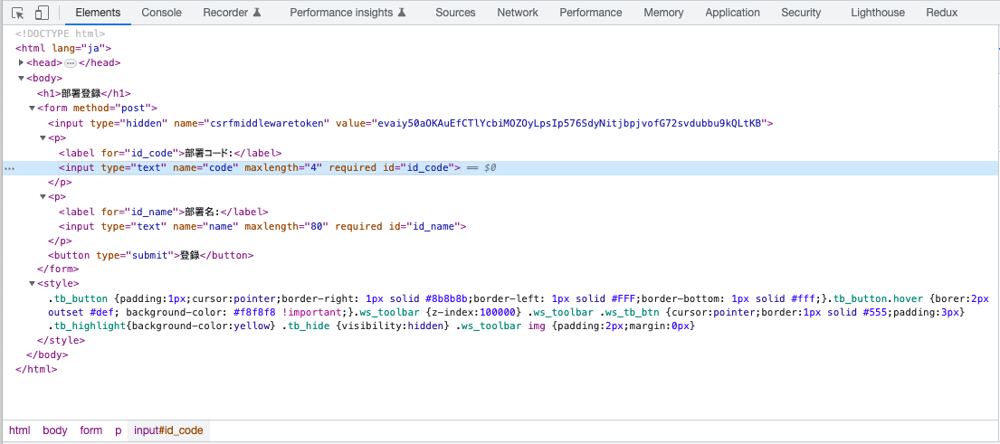

# 部署アプリのビューの実装

- [部署アプリのビューの実装](#部署アプリのビューの実装)
  - [Djangoの基本的なHTTPリクエスト処理](#djangoの基本的なhttpリクエスト処理)
    - [DjangoがHTTPリクエストを処理する手順](#djangoがhttpリクエストを処理する手順)
    - [Djangoのビューの役割と処理内容](#djangoのビューの役割と処理内容)
  - [部署アプリで実装するビュー](#部署アプリで実装するビュー)
  - [部署一覧ページの実装](#部署一覧ページの実装)
    - [部署一覧関数ビューの実装](#部署一覧関数ビューの実装)
    - [部署一覧テンプレートの実装](#部署一覧テンプレートの実装)
      - [Djangoのテンプレート検索](#djangoのテンプレート検索)
    - [部署一覧ビューのディスパッチ](#部署一覧ビューのディスパッチ)
    - [部署一覧ページの表示](#部署一覧ページの表示)
  - [部署詳細ページの実装](#部署詳細ページの実装)
    - [部署詳細関数ビューの実装](#部署詳細関数ビューの実装)
    - [部署詳細テンプレートの実装](#部署詳細テンプレートの実装)
    - [部署詳細ビューのディスパッチ](#部署詳細ビューのディスパッチ)
    - [部署詳細ページの表示](#部署詳細ページの表示)
  - [テンプレートのリファクタリング](#テンプレートのリファクタリング)
    - [ベーステンプレートの実装](#ベーステンプレートの実装)
    - [部署一覧、部署詳細関数ビューのリファクタリング](#部署一覧部署詳細関数ビューのリファクタリング)
    - [部署一覧、部署詳細テンプレートのリファクタリング](#部署一覧部署詳細テンプレートのリファクタリング)
    - [テンプレート検索ディレクトリの設定](#テンプレート検索ディレクトリの設定)
    - [テンプレートフィファクタリング結果の確認](#テンプレートフィファクタリング結果の確認)
  - [部署一覧と部署詳細ページの相互リンク設置](#部署一覧と部署詳細ページの相互リンク設置)
  - [部署登録ページの実装](#部署登録ページの実装)
    - [部署フォームの実装](#部署フォームの実装)
    - [部署登録関数ビューの実装](#部署登録関数ビューの実装)
      - [HTTPリクエストがGETの場合](#httpリクエストがgetの場合)
      - [HTTPリクエストがPOSTの場合](#httpリクエストがpostの場合)
        - [部署フォームの検証に成功した場合](#部署フォームの検証に成功した場合)
        - [部署フォームの検証に失敗した場合](#部署フォームの検証に失敗した場合)
    - [部署フォームテンプレートの実装](#部署フォームテンプレートの実装)
    - [部署登録ビューのディスパッチ](#部署登録ビューのディスパッチ)
    - [部署登録ページの表示と部署の登録](#部署登録ページの表示と部署の登録)
    - [部署コードが一致する部署を登録してみる](#部署コードが一致する部署を登録してみる)
    - [部署登録ページで文字数の多い部署コードを入力してみる](#部署登録ページで文字数の多い部署コードを入力してみる)
    - [部署一覧ページに部署登録ページに遷移するリンクを設置](#部署一覧ページに部署登録ページに遷移するリンクを設置)
  - [部署更新ページの実装](#部署更新ページの実装)
    - [部署更新関数ビューの実装](#部署更新関数ビューの実装)
    - [部署フォームテンプレートの変更](#部署フォームテンプレートの変更)
    - [部署一覧、部署詳細ページに部署更新ページに遷移するリンクを設置](#部署一覧部署詳細ページに部署更新ページに遷移するリンクを設置)
    - [部署更新ビューのディスパッチ](#部署更新ビューのディスパッチ)
  - [部署削除ページの実装](#部署削除ページの実装)
    - [部署削除関数ビューの実装](#部署削除関数ビューの実装)
    - [部署削除テンプレートの実装](#部署削除テンプレートの実装)
    - [部署一覧、部署詳細、部署更新ページに部署削除ページへのリンクを設置](#部署一覧部署詳細部署更新ページに部署削除ページへのリンクを設置)
    - [部署削除ビューのディスパッチ](#部署削除ビューのディスパッチ)
  - [トランザクションの設定](#トランザクションの設定)
  - [まとめ](#まとめ)

## Djangoの基本的なHTTPリクエスト処理

### DjangoがHTTPリクエストを処理する手順

DjangoがHTTPリクエストを処理する手順は、次の通りです。

1. HTTPリクエストを受信します。
2. [URLディスパッチャー](https://docs.djangoproject.com/en/4.2/topics/http/urls/#url-dispatcher)でリクエストURLのパターンを解析して、リクエストを処理するビューを特定します。
3. HTTPリクエストを上記で特定したビューに渡して、ビューがHTTPレスポンスを生成します。
4. ビューが生成したHTTPレスポンスを返却します。

### Djangoのビューの役割と処理内容

Djangoのビューは、HTTPリクエストから[次など](https://docs.djangoproject.com/en/4.2/ref/request-response/#httprequest-objects)を抽出します。

- GETパラメーター
  - `https://www.google.com/search?q=python+django&oq=python+django`
  - 上記`?`より後がGETパラメーターで、`q`と`oq`がパラメーターです。
  - パラメーター`q`の値は`python+django`で、`oq`の値も`python+django`です。
- POSTパラメーター
  - HTTPリクエストボディに含められたデータで、Webページのフォームに入力されたデータなどを渡します。
- [パスコンバーター](https://docs.djangoproject.com/en/4.2/topics/http/urls/#path-converters)がリクエストURLから抽出したデータ
- クッキー
  - Webアプリケーションとブラウザ間で状態を管理するために使用されるデータで、ユーザーの識別などに用いられます。
- アップロードされたファイル

> パスコンバーターは、URLconfに指定されたURLのパターンから、特定のデータを抽出します。

ビューは、HTTPリクエストを受け取ると次のいずれかを実施する必要があります。

- [HttpRequest](https://docs.djangoproject.com/en/4.2/ref/request-response/#httprequest-objects)を受け取り、要求されたコンテンツを含んだ[HttpResponse](https://docs.djangoproject.com/en/4.2/ref/request-response/#django.http.HttpResponse)を返却します（正常系）。
- エラーなど何らかの理由でリクエストを処理できない場合は、[Http404](https://docs.djangoproject.com/en/4.2/topics/http/views/#django.http.Http404)のような例外を投げます（異常系）。

ビューでHTMLコンテンツを生成する基本的な手順を次に示します。

1. データベースから必要なデータを取得します。
2. データベースから取得したデータ及びそれ以外のデータを`コンテキスト`にまとめて、そのコンテキストでHTMLの雛形であるテンプレート（`MVT`の`T`）をレンダリングすることで、HTMLコンテンツを生成します。

コンテキストは、`辞書`のように振る舞います。
コンテキストとして、[django.template.Context](https://docs.djangoproject.com/en/4.2/ref/templates/api/#django.template.Context)や、Pythonの辞書を利用できます。

## 部署アプリで実装するビュー

部署アプリで実装するビューを次に示します。
なお、部署アプリで処理するリクエストURLは、ルートURLconfにより、`/divisions/`で始まります。
また、リクエストURLの`<code>`は、パスコンバーターが抽出した、処理する部署モデルインスタンスを特定するときの部署コードです。

例えば、 `http://<site>/divisions/`はすべての部署を部署一覧ページで表示して、`http://<site>/divisions/58/`はICT開発室を部署詳細ページで表示します。

| リクエストURL | ページ名 |関数ビュー | メソッド | 表示または処理内容 |
| --- | --- | --- | --- | --- |
| （なし） | 部署一覧ページ |`list` | `GET` | 登録されている部署を一覧表示 |
| `<code>/` | 部署詳細ページ | `detail` | `GET` | `code`で特定された部署の属性を表示 |
| `create/` | 部署登録ページ | `create` | `GET` | 登録する部署を入力するフォームを表示 |
| `create/` | 部署登録ページ | `create` | `POST` | 部署モデルインスタンスを登録して部署詳細ページに遷移 |
| `update/<code>/` | 部署更新ページ | `update` | `GET` | `code`で特定された部署を更新するフォームを表示 |
| `update/<code>/` | 部署更新ページ | `update` | `POST` | 部署モデルインスタンスを更新して部署詳細ページに遷移 |
| `delete/<code>/` | 部署削除ページ | `delete` | `GET` | `code`で特定された部署を削除するフォームを表示 |
| `delete/<code>/` | 部署削除ページ | `delete` | `POST` | 部署モデルインスタンスを削除して部署一覧ページに遷移 |

本章では、部署アプリのビューを関数ビューで実装しますが、次の章でクラスビューで再実装します。

## 部署一覧ページの実装

### 部署一覧関数ビューの実装

`./divisions/views.py`の内容を次で置き換えます。

```python
# ./divisions/views.py
from django.http import HttpRequest, HttpResponse
from django.shortcuts import render

from .models import Division


def list(request: HttpRequest) -> HttpResponse:
    """部署一覧関数ビュー"""

    # すべての部署をデータベースから取得
    divisions = Division.objects.all()
    # コンテキストを作成
    context = {"division_list": divisions}
    # コンテキストでテンプレートをレンダリング
    return render(request, "divisions/division_list.html", context)
```

`部署一覧ビュー`関数は、最初にすべての部署をデータベースから取得します。
なお、`divisions`変数の型は`QuerySet`で、 データベースからデータを取得するために柔軟で強力な方法を提供するクラスです。
よって、`divisions`は、すべての部署モデルインスタンスを格納した`QuerySet`です。

`QuerySet`が提供する機能の詳細は[ここ](https://docs.djangoproject.com/en/4.2/ref/models/querysets/)を参照してください。

次に、コンテキストとなる辞書に、`division_list`キーの値としてすべての部署モデルインスタンスを格納した`QuerySet`を設定しています。
この`division_list`は、次に説明するテンプレートをレンダリングするために、コンテキストの識別子として使用されます。

次に、[render](https://docs.djangoproject.com/en/4.2/topics/http/shortcuts/#django.shortcuts.render)関数で、コンテキストを使用してテンプレートをレンダリングすることでHTMLコンテンツを生成して、それを含んだ`HttpResponse`インスタンスを返却しています。

### 部署一覧テンプレートの実装

部署アプリのテンプレートを配置するために、`divisions/templates`ディレクトリを次の通り作成した後、部署一覧テンプレートファイルを作成します。

```bash
# 部署アプリテンプレートディレクトリの作成
mkdir -p ./divisions/templates/divisions
# 部署一覧テンプレートの作成
code ./divisions/templates/divisions/division_list.html
```

その後、部署一覧テンプレートを次の通り実装します。

```html
<!-- ./divisions/templates/divisions/division_list.html -->
<!DOCTYPE html>
<html lang="ja">
<head>
  <meta charset="utf-8"/>
  <title>部署一覧</title>
</head>
<body>
<h1>部署一覧</h1>

  <ul>
    
      <li>{{ division.code }}: {{ division.name }}</li>
    
  </ul>

  <p>部署が存在しません。</p>

</body>
</html>
```

テンプレートでは、コンテキストで渡した辞書の`division_list`キーがコンテキストの識別子として変数のように扱われ、`division_list`で部署一覧ビューで取得したすべての部署モデルインスタンスを格納したクエリセットを参照します。

また、``や``など``で囲まれた構文は、Djangoの[テンプレートタグ](https://docs.djangoproject.com/en/4.2/ref/templates/language/)で、それぞれ`if`文と`for`文のように振る舞います。

さらに、テンプレートに変数を出力するときは、`{{ variable }}`のように`{{`と`}}`で変数を囲みます。

> Djangoがビルトインするテンプレートタグは、[ここ](https://docs.djangoproject.com/en/4.2/ref/templates/builtins/#built-in-tag-reference)を参照してください。

#### Djangoのテンプレート検索

プロジェクト設定ファイル（`./<proj-name>/settings.py`）の`TEMPLATES`で、`APP_DIRS`を`True`に設定すると、Djangoは`<app-name>/templates/<app-name>`ディレクトリをテンプレートの検索対象に含めます。
Djangoが`TemplateDoesNotExist`をスローした場合、プロジェクト設定ファイルのテンプレートの設定を確認してください。

> Djangoバージョン4.2において、`TEMPLATES`の`APP_DIRS`はデフォルトで`True`です。

また、`TEMPLATES`の`DIRS`に設定されたパスも、Djangoがテンプレートを検索する対象に含まれます。

```python
# ./<proj-name>/settings.py
TEMPLATES = [
    {
        "BACKEND": "django.template.backends.django.DjangoTemplates",
        "DIRS": [],
        "APP_DIRS": True,   # <- ここ
        "OPTIONS": {
            "context_processors": [
                "django.template.context_processors.debug",
                "django.template.context_processors.request",
                "django.contrib.auth.context_processors.auth",
                "django.contrib.messages.context_processors.messages",
            ],
        },
    },
]
```

`部署一覧ビュー`関数に実装した`render`関数で、テンプレートに`divisions/division_list.html`を指定しました。
上記設定により、それの`render`関数は`./divisions/templates/divisions/division_list.html`ファイルをテンプレートとして使用します。

> Djangoがテンプレートを探す場所には優先順位があります。
> 期待するテンプレートが使用されない場合は、テンプレートを検索する優先順位を確認してください。

### 部署一覧ビューのディスパッチ

`./divisions/urls.py`のすべての内容を次で置き換えて、部署一覧ビューが処理するリクエストのリクエストURLのパターンを設定します。

```python
# ./divisions/urls.py
from django.urls import path

from . import views

app_name = "divisions"

urlpatterns = [
    # 部署一覧ページ(ex: /divisions/)
    path("", views.list, name="division-list"),
]
```

[path](https://docs.djangoproject.com/en/4.2/ref/urls/#path)関数の第1引数で、第2引数で指定したビューが処理するリクエストURLのパターンを指定します。
また、`path`関数の`name`キーワード引数は、第1引数で指定したリクエストURLのパターンに付ける名前で、[reverse](https://docs.djangoproject.com/en/4.2/ref/urlresolvers/#django.urls.reverse)関数などでURLパターンに付けた名前から、URLパターンを逆引きして、実際のURLを生成するときに利用されます。

### 部署一覧ページの表示

開発サーバーを起動していない場合は開発サーバーを起動します。
そして、ブラウザで`http://localhost:8000/divisions/`にアクセスすると、部署の一覧が表示されるはずです。

部署一覧ページが正常に表示された場合は、次の通りリポジトリに変更をコミットします。

```bash
git add --all
git commit -m '部署一覧ページを実装'
```

> commit 0c1d212d3db07d6431fcb02c85124f88b686ee7d (tag: 010-部署一覧ページを実装)

## 部署詳細ページの実装

### 部署詳細関数ビューの実装

部署詳細関数ビューを次の通り実装します。

```python
# ./divisions/views.py
  from django.http.request import HttpRequest, HttpResponse
- from django.shortcuts import render
+ from django.shortcuts import get_object_or_404, render

  from .models import Division

  def list(request: HttpRequest) -> HttpResponse:
      context = {"division_list": divisions}
      # コンテキストでテンプレートをレンダリング
      return render(request, "divisions/division_list.html", context)
+
+
+ def detail(request: HttpResponse, code: str) -> HttpResponse:
+     """部署詳細関数ビュー
+
+     Args:
+         code: 部署コード
+     """
+
+     # 部署コードから部署モデルインスタンスを取得
+     division = get_object_or_404(Division, pk=code)
+     # コンテキストを渡してテンプレートをレンダリング
+     return render(request, "divisions/division_detail.html", {"division": division})
```

[get_object_or_404](https://docs.djangoproject.com/en/4.2/topics/http/shortcuts/#django.shortcuts.get_object_or_404)関数は、キーワード引数で指定された条件（`pk=code`）で第1引数で指定したモデルのモデルインスタンスを検索して、モデルインスタンスが存在する場合はそのインスタンスを返却して、存在しない場合は`Http404`例外をスローします。
なお、モデルインスタンスを検索する条件となるキーワード引数は、コードで示した以外にも複数指定できます。

部署詳細関数ビューの`get_object_or_404`の部分は次のコードと等価で、特定のモデルインスタンスを取得するコードを容易に実装するために、Djangoが提供するショートカット関数です。

```python
# division = get_object_or_404(Division, pk=code)
try:
    division = Division.objects.filter(pk=code)
except Division.DoesNotExist:
    raise Http404("No MyModel matches the given query.")
```

### 部署詳細テンプレートの実装

部署詳細テンプレートを次の通り実装します。

```html
<!-- ./divisions/templates/divisions/division_detail.html -->
<!DOCTYPE html>
<html lang="ja">
<head>
  <meta charset="utf-8"/>
  <title>部署詳細</title>
</head>
<body>
  <h1>部署詳細</h1>
  <div>部署コード: {{ division.code }}</div>
  <div>部署名: {{ division.name }}</div>
</body>
</html>
```

### 部署詳細ビューのディスパッチ

`./divisions/urls.py`を次の通り変更して、部署詳細ビューが処理するリクエストURLのパターンを設定します。

```python
# ./divisions/urls.py
  urlpatterns = [
      # 部署一覧ページ(ex: /divisions/)
      path("", views.list, name="division-list"),
+     # 部署詳細ページ (ex: /divisions/<code>/)
+     path("<str:code>/", views.detail, name="division-detail"),
  ]
```

### 部署詳細ページの表示

開発サーバーを起動していない場合は開発サーバーを起動します。
そして、ブラウザで`http://localhost:8000/divisions/58/`にアクセスすると、ICT開発室が表示されるはずです。

部署詳細ページが正常に表示された場合は、次の通りリポジトリに変更をコミットします。

```bash
git add ./divisions/
git commit -m '部署詳細ページを実装'
```

> commit d757b0555647357d55972472740e5bd549dba3b9 (tag: 011-部署詳細ページを実装)

## テンプレートのリファクタリング

`リファクタリング`とは、外部から見たときの動作を変えずに、プログラムの内部構造を整理することです。
部署一覧テンプレートと部署詳細テンプレートには、HTMLヘッダなど重複する実装があります。
[DRY (Don't Repeat Yourself)](https://e-words.jp/w/DRY%E5%8E%9F%E5%89%87.html)の精神に従って、テンプレートをリファクタリングします。

### ベーステンプレートの実装

すべてのテンプレートの基本となるベーステンプレート（`./templates/base.html`）をプロジェクトディレクトリの`templates`ディレクトリに以下の通り作成します。

```bash
mkdir ./templates
code ./templates/base.html
```

`./templates/base.html`を次の通り実装します。

```html
<!-- ./templates/base.html -->
<!DOCTYPE html>
<html lang="ja">
<head>
  <meta charset="utf-8"/>
  
    <title>{{ title }}</title>
  
</head>
<body>

</body>
</html>
```

HTMLの`head`要素の`title`要素のコンテンツを、`title`コンテキストで渡します。
基本テンプレートの``の部分は、基本テンプレートを継承した部署一覧テンプレートなどの他のテンプレートで置き換えられます。
基本テンプレートを継承するテンプレートは、ブロックの名前（上記`title`や`inner_body`）を指定して、ベーステンプレートのコンテンツを置き換えます。

### 部署一覧、部署詳細関数ビューのリファクタリング

部署一覧及び部署詳細関数ビューを次の通り変更します。

```python
# ./divisions/views.py
  def list(request: HttpRequest) -> HttpResponse:
      """部署一覧関数ビュー"""

      # すべての部署を取得
      divisions = Division.objects.all()
      # コンテキストを作成
-     context = {"division_list": divisions}
+     context = {
+         "title": "部署一覧",
+         "division_list": divisions,
+     }
      # コンテキストでテンプレートをレンダリング
      return render(request, "divisions/division_list.html", context)

  def detail(request: HttpResponse, code: str) -> HttpResponse:
      """部署詳細関数ビュー

      Args:
          code: 部署コード
      """

      # 部署コードから部署を取得
      division = get_object_or_404(Division, pk=code)
      # コンテキストを渡してテンプレートをレンダリング
-     return render(request, "divisions/division_detail.html", {"division": division})
+     return render(
+         request,
+         "divisions/division_detail.html",
+         {"title": "部署詳細", "division": division},
+     )
```

### 部署一覧、部署詳細テンプレートのリファクタリング

部署一覧テンプレートを次で置き換えます。

`extends`テンプレートタグで、ベーステンプレートを継承します。

```html
<!-- ./divisions/templates/divisions/division_list.html -->



  <h1>部署一覧</h1>
  
    <ul>
      
        <li>{{ division.code }}: {{ division.name }}</li>
      
    </ul>
  
    <p>部署が存在しません。</p>
  

```

部署詳細テンプレートを次で置き換えます。

```html
<!-- ./divisions/templates/divisions/division_list.html -->



  <h1>部署詳細</h1>
  <div>部署コード: {{ division.code }}</div>
  <div>部署名: {{ division.name }}</div>

```

### テンプレート検索ディレクトリの設定

Djangoが`./templates`ディレクトリに格納したテンプレートを検索するように、プロジェクト設定ファイルを次の通り変更します。

```python
# ./book_management/settings.py
+ import os
  from pathlib import Path
  from typing import List
```

```python
# ./book_management/settings.py
  TEMPLATES = [
      {
          "BACKEND": "django.template.backends.django.DjangoTemplates",
-         "DIRS": [],
+         "DIRS": [os.path.join(BASE_DIR, "templates"),],
          "APP_DIRS": True,
          "OPTIONS": {
              "context_processors": [
                  "django.template.context_processors.debug",
                  "django.template.context_processors.request",
                  "django.contrib.auth.context_processors.auth",
                  "django.contrib.messages.context_processors.messages",
              ],
          },
      },
  ]
```

### テンプレートフィファクタリング結果の確認

開発サーバーを起動していない場合は開発サーバーを起動します。
部署一覧ページ及び部署詳細ページにアクセスすると、最初に実装したときと同様にページが表示されるはずです。

各ページが正常に表示された場合は、次の通りリポジトリに変更をコミットします。

```bash
git add --all
git commit -m 'テンプレートをリファクタリング'
```

> commit 02b5bbfa3475430e2d6719d1de417176bc9dc947 (tag: 012-テンプレートをリファクタリング)

## 部署一覧と部署詳細ページの相互リンク設置

部署一覧ページから部署詳細ページに遷移するリンクを次の通り設置します。

`url`テンプレートタグは、ページのURLを逆引きして、実際のURLに置き換えます。
`division-detail`や`division-list`は、`./divisions/urls.py`の`path`関数で指定したビューの名前です。
部署詳細ページ（`division-detail`）のURLは、部署の部署コードを渡す必要があるため、それを`url`テンプレート構文に渡しています。

```html
<!-- ./divisions/templates/divisions/division_list.html -->
  
- <li>{{ division.code }}: {{ division.name }}</li>
+ <li>
+   {{ division.code }}: {{ division.name }}
+   <a href="">詳細</a>
+ </li>
  
```

部署詳細ページから部署一覧ページに遷移するリンクを次の通り設置します。

```html
<!-- ./divisions/templates/divisions/division_detail.html -->
  <div>部署名: {{ division.name }}</div>
+ <div>
+   <a href="">部署一覧</a>
+ </div>
  
```

部署一覧ページと部署詳細ページに相互リンクが設置され、相互にページ遷移できた場合は、次の通りリポジトリに変更をコミットします。

```bash
git add --all
git commit -m '部署一覧ページと部署詳細ページに相互リンクを設置'
```

> commit 5284379092d83487c53bc50dd71ae87c31e63705 (tag: 013-部署一覧ページと部署詳細ページに相互リンクを設置)

## 部署登録ページの実装

### 部署フォームの実装

Webアプリケーションにおいて、Webアプリケーションにデータを渡すために[フォーム](https://developer.mozilla.org/ja/docs/Learn/Forms)が利用されます。

Djangoはモデルからフォームを自動的に作成する[ModelForm](https://docs.djangoproject.com/en/4.1/topics/forms/modelforms/#modelform)を提供しています。
`./divisions/forms.py`ファイルを作成して、そのファイルに`ModelForm`を継承した部署フォームを実装します。

```python
# ./divisions/forms.py
from django import forms

from .models import Division


class DivisionForm(forms.ModelForm):
    """部署フォーム"""

    class Meta:
        model = Division
        fields = ["code", "name"]
```

Pythonインタラクティブシェルを起動して次を実行すると、フォームをレンダリングしたときのHTMLコンテンツが出力されます。

```bash
python manage.py shell
```

```python
from divisions.forms import DivisionForm
form = DivisionForm()
form.as_p()
# '<p>\n    <label for="id_code">部署コード:</label>\n    <input type="text" name="code" maxlength="2" required id="id_code">\n    \n    \n  </p>\n\n  \n  <p>\n    <label for="id_name">部署名:</label>\n    <input type="text" name="name" maxlength="80" required id="id_name">\n    \n    \n      \n    \n  </p>'
form.as_table()
# '<tr>\n    <th><label for="id_code">部署コード:</label></th>\n    <td>\n      \n      <input type="text" name="code" maxlength="2" required id="id_code">\n      \n      \n    </td>\n  </tr>\n\n  <tr>\n    <th><label for="id_name">部署名:</label></th>\n    <td>\n      \n      <input type="text" name="name" maxlength="80" required id="id_name">\n      \n      \n        \n      \n    </td>\n  </tr>'
```

### 部署登録関数ビューの実装

部署登録関数ビューを次の通り実装します。

```python
# ./divisions/views.py
  from django.http.request import HttpRequest, HttpResponse
- from django.shortcuts import get_object_or_404, render
+ from django.shortcuts import get_object_or_404, redirect, render

+ from .forms import DivisionForm
  from .models import Division

  (...省略...)

+ def create(request: HttpResponse) -> HttpResponse:
+     """部署登録関数ビュー"""
+
+     if request.method == "POST":
+         # POSTパラメーターから部署フォームを構築
+         form = DivisionForm(request.POST)
+         if form.is_valid():
+             division = form.save()
+             return redirect("divisions:division-detail", code=division.code)
+     else:  # request.method is "GET", maybe.
+         # フォームを構築
+         form = DivisionForm()
+     # コンテキストを渡してテンプレートをレンダリング
+     return render(
+         request,
+         "divisions/division_form.html",
+         {"title": "部署登録", "form": form, "action": "登録"},
+     )
```

#### HTTPリクエストがGETの場合

部署登録関数ビューで実装した`if`文の`else`ブロックが実行されます。
この`else`ブロックでは、部署フォームを構築するのみです。

部署登録関数ビューの最後の行の`render`関数は、フォームテンプレートをタイトル、先に構築した部署フォーム及び操作名でレンダリングしたHTMLコンテンツを含む`HttpResponse`を返却します。

#### HTTPリクエストがPOSTの場合

部署登録関数ビューで実装した`if`文の`if`ブロックが実行されます。
`request.POST`には、ブラウザから送信されたデータが含まれています。
部署登録関数ビューの`if`ブロックの最初で、`request.POST`から部署フォームを構築しています。

次に、`ModelForm`の`is_valid`メソッドで、フォームに入力された内容を検証しています。
`is_valid`メソッドは、フォームの検証に成功したときは`True`、失敗したときは`False`を返却します。

##### 部署フォームの検証に成功した場合

部署フォームの検証に成功した場合は、`ModelFrom`の`save`メソッドで部署モデルインスタンスをデータベースに登録して、登録した部署モデルインスタンスを取得します。
この部署モデルインスタンスには、登録日時と更新日時が自動で記録されます。

最後に、部署詳細ビューのURLパターンに付けられた名前とデータベースに登録した部署モデルインスタンスの部署コードを`redirect`関数に渡して、その部署モデルインスタンスを表示する部署詳細ページに遷移させる[`301 Moved Permanently`](https://developer.mozilla.org/ja/docs/Web/HTTP/Redirections)をレスポンスヘッダに持つ`HttpResponse`を返却します。

##### 部署フォームの検証に失敗した場合

`request.POST`から構築され、検証した結果を含む部署フォームで、部署フォームテンプレートをレンダリングしたHTMLコンテンツを含む`HttpResponse`を返却します。

### 部署フォームテンプレートの実装

部署フォームテンプレートを次の通り実装します。

```html
<!-- ./divisions/templates/divisions/division_form.html -->



  <h1>部署{{ action }}</h1>
  <form method="post">
    
    {{ form.as_p }}
    <button type="submit">{{ action }}</button>
  </form>
  <div><a href="">部署一覧</a></div>

```

[csrf_token](https://docs.djangoproject.com/en/4.2/ref/templates/builtins/#csrf-token)テンプレートタグは、[クロスサイト・リクエスト・フォージェリ (CSRF)](https://www.ipa.go.jp/security/vuln/websecurity/csrf.html)攻撃を防ぐために、Webアプリケーションがブラウザに送信して、ブラウザが何も加工せずにそれをWebアプリケーションに戻す、一時的なランダムな文字列を生成します。

`{{ form.as_p }}`は、フォーム要素を`<p>`タグで囲んでHTMLを出力します。

部署の登録を実行する登録ボタンの種類は`submit`で、そのボタンラベルはコンテキスト（`action`）で受け取っています。
部署登録ページに部署コードと部署名を入力して、登録ボタンをクリックすると、現在のURLに（`form`要素の`action`属性を省略しているため）`POST`メソッドでフォームデータを送信します。

### 部署登録ビューのディスパッチ

`./divisions/urls.py`を次の通り変更して、部署登録ビューが処理するリクエストのリクエストURLのパターンを設定します。

```python
# ./divisions/urls.py
  urlpatterns = [
      # 部署一覧ページ(ex: /divisions/)
      path("", views.list, name="division-list"),
+     # 部署登録ページ (ex: /divisions/create/)
+     path("create/", views.create, name="division-create"),
      # 部署詳細ページ (ex: /divisions/<code>/)
      path("<str:code>/", views.detail, name="division-detail"),
  ]
```

部署登録ビューをディスパッチする`path`関数の位置に注意してください。

例えば、部署詳細ページの下に部署登録ビューの`path`関数を置くと、"create"が`<str:code>`にマッチして、部署詳細関数ビューが部署コード`create`の部署を部署詳細ページで表示しようと試みます。
このとき、部署詳細関数ビューは、`Http404`例外をスローして、Djangoのエラーページが表示されるはずです（プロジェクト設定ファイルで`DEBUG = True`が指定されているため）。

### 部署登録ページの表示と部署の登録

開発サーバーを起動していない場合は開発サーバーを起動します。
ブラウザで`http://localhost:8000/divisions/create/`にアクセスして部署登録ページを表示します。

表示された部署登録ページの部署コードに`54`、部署名に`橋梁構造第1Ｇ`を入力して、登録ボタンをクリックします。
橋梁構造第1Ｇが登録されて、橋梁構造第1Ｇを表示する部署詳細ページにリダイレクトするはずです。

### 部署コードが一致する部署を登録してみる

部署登録ページを表示して、部署コードに`58`、部署名に`ICT開発室（重複）`と入力して登録ボタンをクリックします。
部署の登録に失敗して、登録しようとした部署の部署コードと同じ部署コードを持つ部署がすでに登録されていることを示す部署登録ページが表示されるはずです。

### 部署登録ページで文字数の多い部署コードを入力してみる

部署登録ページを表示したChromeで`F12`キーを押下すると、Chromeの`DevTool`が表示されます。

`DevTool`の`Elements`タブをクリックします。
次に、`body`をマウスで右クリックして表示されるメニューから`Expand recursively`をクリックして、`body`要素を展開します。
次に、`<input type="text" name="code" maxlength="2" required="" id="id_code">`の`maxlength="2"`の`2`の部分をダブルクリックして`4`に変更します。
その後、HTMLの変更を確定するために、`label`要素など他の要素を選択してください。



最後に、部署登録ページの部署コードに`9999`を、部署名に`ダミー部署`と入力して登録ボタンをクリックします。

部署の登録に失敗して、登録しようとした部署の部署コードの文字数が長いことを示す部署登録ページが表示されるはずです。

### 部署一覧ページに部署登録ページに遷移するリンクを設置

`./divisions/templates/divisions/division_list.html`ファイルを開いて、``の上の行に、次を追加します。

```html
<!-- ./divisions/templates/divisions/division_list.html -->
  
+ <a href="">部署登録</a>
  
```

これで、部署一覧ページと部署登録ページが相互リンクを持つようになりました。

部署登録ページで部署を登録でき、部署一覧ページと部署登録ページの相互リンクが機能した場合は、次の通りリポジトリに変更をコミットします。

```bash
git add --all
git commit -m '部署登録ページを実装'
```

> commit 01e1be7c2a3e77222d7888abf6b010ac6a6483a6 (HEAD -> main, tag: 014-部署登録ページを実装)

## 部署更新ページの実装

部署更新ページは、部署フォームと部署テンプレートを部署登録ページと共有します。

### 部署更新関数ビューの実装

部署更新関数ビューを次の通り実装します。

```python
# ./divisions/views.py
def update(request: HttpRequest, code: str) -> HttpResponse:
    """部署更新関数ビュー

    Args:
        code: 部署コード
    """

    # 部署コードから部署モデルインスタンスを取得
    division = get_object_or_404(Division, pk=code)
    if request.method == "POST":
        # POSTパラメーターから部署フォームを構築
        form = DivisionForm(request.POST, instance=division)
        if form.is_valid():
            division = form.save(commit=False)
            division.code = code
            division.save()
            return redirect("divisions:division-detail", code=division.code)
    else:  # request.method is "GET", maybe.
        # 部署モデルインスタンスから部署フォームを構築
        form = DivisionForm(instance=division)
    form.fields["code"].widget.attrs["readonly"] = True
    return render(
        request,
        "divisions/division_form.html",
        {"title": "部署更新", "form": form, "action": "更新"},
    )
```

部署更新関数ビューは、部署登録関数ビューとほとんど同じですが、次の違いがあります。

- HTTPリクエストメソッドが`GET`の場合、部署モデルインスタンスから部署フォームを構築します。
- HTTPリクエストメソッドが`POST`の場合、`request.POST`と部署モデルインスタンスから部署フォームを構築します。
- 部署フォームに`save`メソッドを実行したとき、データベースに保存せずに（`commit=False`）、部署フォームから部署モデルインスタンスを取得します。
  - 部署フォームから取得した部署モデルインスタンスの部署コードに、リクエストURLから取得した部署コードを強制的に設定します。
  - 上記部署モデルインスタンスをデータベースに保存します。
- 部署フォームの部署コードフォームフィールドを読み取り専用に設定（`form.fields["code"].widget.attrs["readonly"] = True`）

### 部署フォームテンプレートの変更

部署フォームテンプレートに部署詳細ページへのリンクを設置します。
部署フォームテンプレートは、部署登録ページと共有されているため、部署登録ページをレンダリングするときは、部署詳細ページへのリンクを表示しないようにします。

```html
<!-- ./divisions/templates/divisions/division_form.html -->
  

  
    <h1>部署{{ action }}</h1>
    <form method="post">
       {{ form.as_p }}
      <button type="submit">{{ action }}</button>
    </form>
-   <div><a href="">部署一覧</a></div>
+   <div>
+     <a href="">部署一覧</a>
+     
+       <a href="">部署詳細</a>
+     
+   </div>
  

```

### 部署一覧、部署詳細ページに部署更新ページに遷移するリンクを設置

部署一覧テンプレートを次の通り変更します。

```html
<!-- ./divisions/templates/divisions/division_list.html -->
          <li>
            {{ division.code }}: {{ division.name }}
            <a href="">詳細</a>
+           <a href="">更新</a>
          </li>
```

部署詳細テンプレートを次の通り変更します。

```html
<!-- ./divisions/templates/divisions/division_detail.html -->
    <div>
      <a href="">部署一覧</a>
+     <a href="">部署更新</a>
    </div>
```

### 部署更新ビューのディスパッチ

`./divisions/urls.py`を次の通り変更して、部署更新ビューが処理するリクエストのリクエストURLのパターンを設定します。

```python
# ./divisions/urls.py
  urlpatterns = [
      # 部署一覧ページ(ex: /divisions/)
      path("", views.list, name="division-list"),
      # 部署登録ページ (ex: /divisions/create/)
      path("create/", views.create, name="division-create"),
      # 部署詳細ページ (ex: /divisions/<code>/)
      path("<str:code>/", views.detail, name="division-detail"),
+     # 部署更新ページ (ex: /divisions/update/<code>/)
+     path("update/<str:code>/", views.update, name="division-update"),
  ]
```

部署更新ページで部署を更新でき、各ページに設置したリンクが機能した場合は、次の通りリポジトリに変更をコミットします。

```bash
git add ./divisions/
git commit -m '部署更新ページを実装'
```

> commit d5e30e87b2d39a81b355440528df60005d02175a (tag: 015-部署更新ページを実装)

## 部署削除ページの実装

### 部署削除関数ビューの実装

部署削除関数ビューを次の通り実装します。

```python
# ./divisions/views.py
def delete(request: HttpRequest, code: str) -> HttpResponse:
    """部署削除関数ビュー

    Args:
        code: 部署コード
    """

    # 部署コードから部署モデルインスタンスを取得
    division = get_object_or_404(Division, pk=code)
    if request.method == "POST":
        division.delete()
        return redirect("divisions:division-list")
    return render(
        request, "divisions/division_confirm_delete.html", {"division": division}
    )
```

### 部署削除テンプレートの実装

部署削除テンプレートを次の通り実装します。

```html
<!-- ./divisions/templates/divisions/division_confirm_delete.html -->



  <h1>部署削除</h1>
  <div>部署コード: {{ division.code }}</div>
  <div>部署名: {{ division.name }}</div>
  <p>上記の部署を削除しますか?</p>
  <form method="post">
    
    <button type="submit">削除</button>
  </form>
  <div>
    <a href="">部署一覧</a>
    <a href="">部署詳細</a>
    <a href="">部署更新</a>
  </div>

```

### 部署一覧、部署詳細、部署更新ページに部署削除ページへのリンクを設置

部署一覧テンプレートに部署削除ページへのリンクを次の通り設置します。

```html
<!-- divisions/templates/divisions/division_list.html -->
          <li>
            {{ division.code }}: {{ division.name }}
            <a href="">詳細</a>
            <a href="">更新</a>
+           <a href="">削除</a>
          </li>
```

部署詳細テンプレートに部署削除ページへのリンクを次の通り設置します。

```html
<!-- divisions/templates/divisions/division_detail.html -->
    <div>
      <a href="">部署一覧</a>
      <a href="">部署更新</a>
+     <a href="">部署削除</a>
    </div>
```

部署フォームテンプレートに部署削除ページへのリンクを次の通り設置します。

```html
<!-- divisions/templates/divisions/division_form.html -->
    <div>
      <a href="">部署一覧</a>
      
        <a href="">部署詳細</a>
+       <a href="">部署削除</a>
      
    </div>
```

### 部署削除ビューのディスパッチ

`./divisions/urls.py`を次の通り変更して、部署削除ビューが処理するリクエストのリクエストURLのパターンを設定します。

```python
# ./divisions/urls.py
  urlpatterns = [
      # 部署一覧ページ(ex: /divisions/)
      path("", views.list, name="division-list"),
      # 部署登録ページ (ex: /divisions/create/)
      path("create/", views.create, name="division-create"),
      # 部署詳細ページ (ex: /divisions/<code>/)
      path("<str:code>/", views.detail, name="division-detail"),
      # 部署更新ページ (ex: /divisions/update/<code>/)
      path("update/<str:code>/", views.update, name="division-update"),
+     # 部署削除ページ (ex: /divisions/delete/<code>/)
+     path("delete/<str:code>/", views.delete, name="division-delete"),
  ]
```

部署削除ページで部署を削除でき、それぞれの部署ページに設置したリンクが機能した場合は、次の通りリポジトリに変更をコミットします。

```bash
git add --all
git commit -m '部署削除ページを実装'
```

> commit d6caf52df0fad4428767b96179589c2afabc9dbc (tag: 016-部署削除ページを実装)

## トランザクションの設定

Djangoはデフォルトで、トランザクション分離レベル`リードコミット`で、自動コミットモードで動作します。
なお、トランザクション分離レベルについては[PostgreSQL](https://www.postgresql.jp/document/14/html/transaction-iso.html)のドキュメントを参照してください。

上記により、Djangoは、トランザクションが開始されていない限り、`Model.save`メソッドなどで発行されたクエリは、すぐにデータベースにコミット（反映）されます。

本チュートリアルで、1つのリクエスト（ビューの処理）で、複数のモデルインスタンスを登録、更新及び削除することはありません。
しかし、ビューで複数モデルをデータベースに反映する場合、それらの処理をアトミック（原子性）にする必要があります。
それらをまとめた処理がアトミックでない場合、リクエストを処理するときに何らかの例外が発生したとき、あるモデルインスタンスはデータベースに反映され、あるモデルインスタンスは反映されないなど、データの一貫性を保証できない（データ間で矛盾が発生する）場合があります。

部署登録、部署更新、及び部署削除関数ビューで、データベースにモデルインスタンスを反映する処理をアトミックにするために、それぞれのビューを次の通り変更します。

> 繰り返しになりますが、それぞれのビューは、1つの部署モデルインスタンスをデータベースに登録、更新または削除するのみであるため、アトミックである必要はないのですが・・・。

```python
# ./divisions/views.py
+ from django.db import transaction
  from django.http.request import HttpRequest
  from django.http.response import HttpResponse
  from django.shortcuts import get_object_or_404, redirect, render

  (...省略...)
  # create関数ビュー内
          # POSTパラメーターから部署フォームを構築
          form = DivisionForm(request.POST)
          if form.is_valid():
-             division = form.save()
+             with transaction.atomic():
+                 division = form.save()
              return redirect("division-detail", code=division.code)

  (...省略...)

  # update関数ビュー内
          if form.is_valid():
              division = form.save(commit=False)
              division.code = code
-             division.save()
+             with transaction.atomic():
+                 division = form.save()
              return redirect("division-detail", code=division.code)

  (...省略...)

  # delete関数ビュー内
      # 部署コードから部署モデルインスタンスを取得
      division = get_object_or_404(Division, pk=code)
      if request.method == "POST":
-         division.delete()
+         with transaction.atomic():
+             division.delete()
          return redirect("division-list")
```

`with transaction.atomic()`ブロック内は、トランザクションが開始されてアトミックな処理になります。

次の通りリポジトリに変更をコミットします。

```bash
git add ./divisions/views.py
git commit -m '部署登録、更新及び削除ビューでトランザクションを開始'
```

> commit 8e7ea2a2036821e5a47bcf5617e07cd928c9f182 (tag: 017-部署登録、更新及び削除ビューでトランザクションを開始)

本チュートリアルでは、データベースにデータが反映される`QuerySet API`のみをトランザクション内で実行するようにしました。
ビュー全体の処理が、トランザクション内で実行されるようにするには、次の通り、関数ビューを`transaction.atomic`デコレーターで修飾します。

```python
from django.db import transaction


@transaction.atomic
def foo(request):
    # foo関数内の処理は、トランザクジョン内で実行されます。
    do_something()
```

また、プロジェクト設定ファイルに次を追加することで、すべてのビューの処理がトランザクション内で実行されます。

```python
# ./book_management/settings.py
  DATABASES = {
      "default": {
          "ENGINE": "django.db.backends.sqlite3",
          "NAME": BASE_DIR / "db.sqlite3",
+         "ATOMIC_REQUESTS": True,
      }
  }
```

ただし、`@non_atomic_requests`デコレーターで修飾されたビューは、`ATOMIC_REQUEST = True`でもトランザクション内で処理されません。

> **HTTPリウエストでトランザクションを試みる - Djangoドキュメント**
>
> Webでトランザクションを処理する一般的な方法は、それぞれのリクエストをトランザクションでラップすることです。
> この振る舞いを有効にする場合は、それぞれのデータベース設定の[ATOMIC_REQUESTS](https://docs.djangoproject.com/en/4.2/ref/settings/#std-setting-DATABASE-ATOMIC_REQUESTS)を**True**に設定します。
>
> それは、次のように動作します。
> Djangoは、関数ビューを呼び出す前に、トランザクションを開始します。
> もし、問題なくレスポンスが生成された場合、Djangoはトランザクションをコミットします。
> もし、ビューが例外をスローした場合、Djangoはトランザクションをロールバックします。
>
> 典型的に、[atomic()](https://docs.djangoproject.com/en/4.2/topics/db/transactions/#django.db.transaction.atomic)コンテキストマネージャーで、ビュー内でセーブポイントを使用してサブトランザクションを実行できます。
> しかし、ビューの最後で**すべての変更**または**変更なし**のどちらかが確定します。
>
> ⚠️ **Warning**
>
> このトランザクションモデルの単純さは魅力的ですが、トランザクションが増加したとき非効率になります。
> すべてのビューでトランザクションを開始することは、オーバーヘッドが発生します。
> パフォーマンスの影響はアプリケーションのクエリパターンと、どの程度データベースがロックをうまく処理するかに依存します。

## まとめ

本章では、部署モデルインスタンスを`CRUD`する一連のページを実装しました。
Webアプリケーションは、本チュートリアルで実施した通り、モデルインスタンスを一覧表示、詳細表示、登録、更新及び削除するページで構成されることがほとんどです。

次の章では、Djangoのクラスビューで本章で実装した関数ビューをリファクタリングします。
Djangoのクラスビューは、一覧表示、詳細表示、登録、更新及び削除するページに必要な機能を提供しており、本章で実装した多くのコードを省略できます。
