# 書籍アプリページの実装

- [書籍アプリページの実装](#書籍アプリページの実装)
  - [ミックスインの整理](#ミックスインの整理)
  - [書籍分類ページの実装](#書籍分類ページの実装)
  - [書籍分類詳細ページの実装](#書籍分類詳細ページの実装)
    - [書籍分類詳細一覧ビューの実装](#書籍分類詳細一覧ビューの実装)
    - [ClassificationDetailSingleObjectMixinの実装](#classificationdetailsingleobjectmixinの実装)
    - [書籍分類詳細ビューの実装](#書籍分類詳細ビューの実装)
    - [ClassificationDetailFormMixinの実装](#classificationdetailformmixinの実装)
    - [書籍分類詳細登録、更新及び削除ビューの実装](#書籍分類詳細登録更新及び削除ビューの実装)
    - [変更のコミット](#変更のコミット)
  - [書籍分類詳細一覧ページで書籍分類詳細を書籍分類でフィルタ](#書籍分類詳細一覧ページで書籍分類詳細を書籍分類でフィルタ)
  - [書籍ページの実装](#書籍ページの実装)
    - [書籍一覧ページの実装](#書籍一覧ページの実装)
    - [書籍詳細ページの実装](#書籍詳細ページの実装)
    - [書籍フォームの実装](#書籍フォームの実装)
    - [書籍登録ページの実装](#書籍登録ページの実装)
    - [書籍更新ページの実装](#書籍更新ページの実装)
    - [書籍削除ページの実装](#書籍削除ページの実装)
  - [トランザクション](#トランザクション)
    - [デコレーター](#デコレーター)
  - [まとめ](#まとめ)

## ミックスインの整理

部署アプリのビューを実装するときに定義した`PageTitleMixin`及び`FormActionMixin`は、部署アプリのビューで再利用するため、`core`モジュールに移動します。

> 部署の`DivisionSingleObjectMixin`や`DivisionFormMixin`も書籍分類モデルと同様な実装になりますが、部署と書籍分類は概念が異なるため、再利用することは`やり過ぎたDRY`になるアンチパターンです。
> `PageTitleMixin`はHTMLの`head`要素の`title`要素のコンテンツを設定する、`FormActionMixin`は操作名を提供するミックスインで、ビュー共通の振る舞いを提供するため再利用します。

`./core/mixins.py`ファイルを作成して、`PageTitleMixin`と`FormActionMixin`をそのファイルに移動します。

```python
# ./core/mixins.py
from typing import Any, Dict

from django.views import generic


class PageTitleMixin(generic.base.ContextMixin):
    """ページタイトルミックスイン"""

    title = None

    def get_context_data(self, **kwargs: Any) -> Dict[str, Any]:
        ctx = super().get_context_data(**kwargs)
        ctx["title"] = self.title
        return ctx


class FormActionMixin(generic.base.ContextMixin):
    """フォームアクションミックスイン"""

    action = None

    def get_context_data(self, **kwargs: Any) -> Dict[str, Any]:
        ctx = super().get_context_data(**kwargs)
        ctx["action"] = self.action
        return ctx
```

その後、`./divisions/views.py`を次の通り変更します。

```python
# ./divisions/views.py
- from typing import Any, Dict, Type
+ from typing import Type

  from django import forms
  from django.urls import reverse, reverse_lazy
  from django.views import generic

+ from core.mixins import FormActionMixin, PageTitleMixin
+
  from .models import Division

  (...略...)

- class PageTitleMixin(generic.base.ContextMixin):
-     """ページタイトルミックスイン"""
-
-     title = None
-
-     def get_context_data(self, **kwargs: Any) -> Dict[str, Any]:
-         ctx = super().get_context_data(**kwargs)
-         ctx["title"] = se
-
-
- class FormActionMixin(generic.base.ContextMixin):
-     """フォームアクションミックスイン"""
-
-     action = None
-
-     def get_context_data(self, **kwargs: Any) -> Dict[str, Any]:
-         ctx = super().get_context_data(**kwargs)
-         ctx["action"] = self.action
-         return ctx
```

部署アプリのすべてのビューが正常に動作することを確認したら、変更をリポジトリにコミットします。

```bash
git add ./divisions/views.py
git add ./core/mixins.py
git commit -m 'ミックスインを整理'
```

> b11d94c (tag: 036-organize-mixins)

## 書籍分類ページの実装

書籍分類ページを部署ページと同様に実装してください。
書籍分類ページとリクエストURLの対応を次の通りとします。

- 書籍分類一覧ページ: `/books/classifications/`
- 書籍分類詳細ページ: `/books/classifications/<code>`
- 書籍分類登録ページ: `/books/classifications/create/`
- 書籍分類更新ページ: `/books/classifications/update/<code>`
- 書籍分類削除ページ: `/books/classifications/delete/<code>`

なお、書籍アプリのURLconfに次を追加することを忘れないでください。

```python
# ./books/urls.py

app_name = "books"
```

書籍分類ページを実装して、書籍分類ページが正常に機能することが確認できたら、次の通り変更をリポジトリにコミットしてください。

> 5a9f8c3 (tag: 037-implement-classification-page)

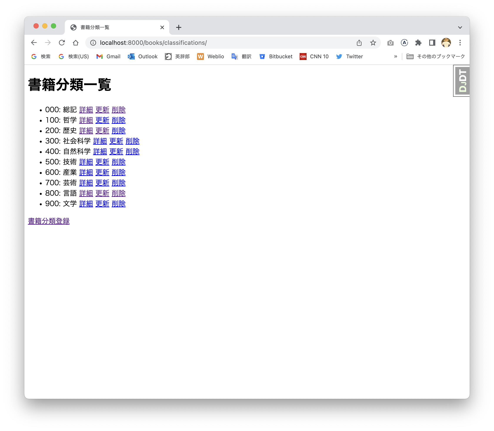

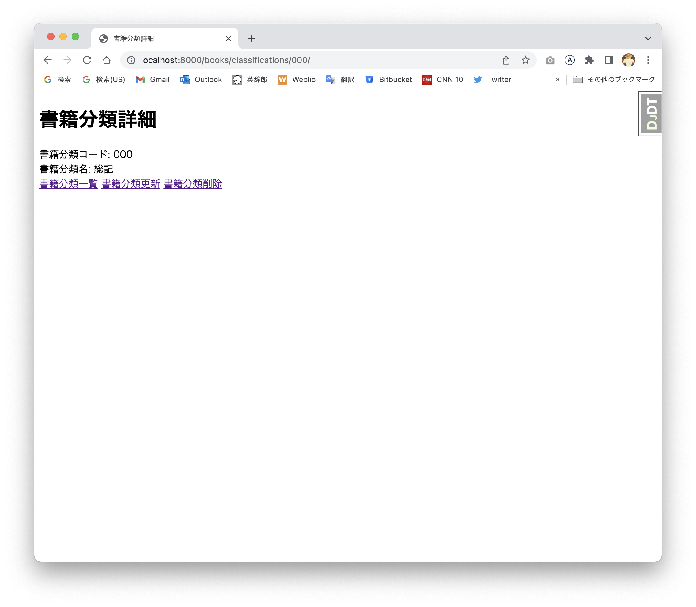

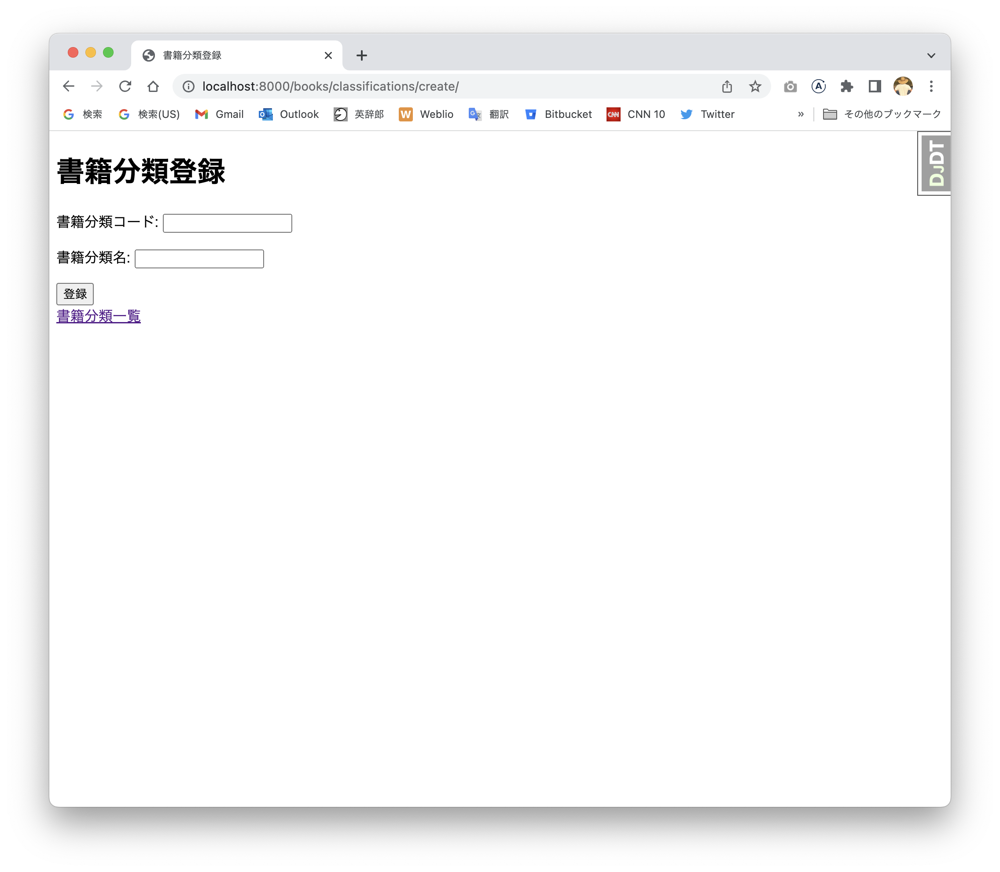

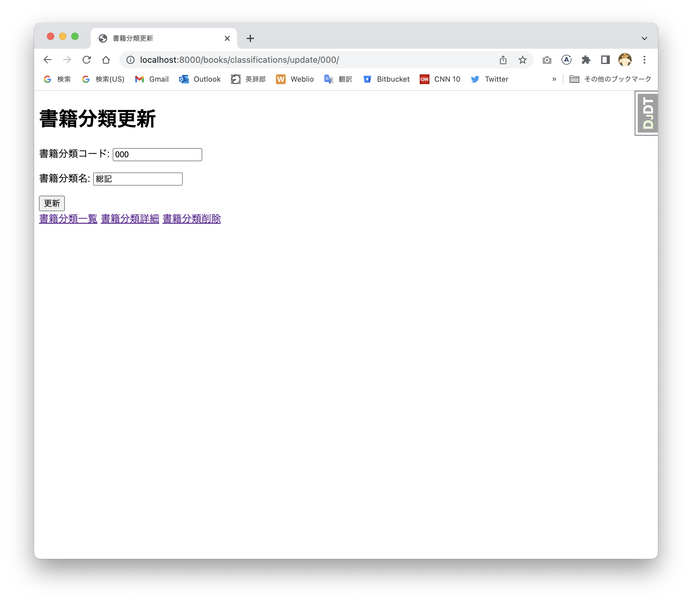

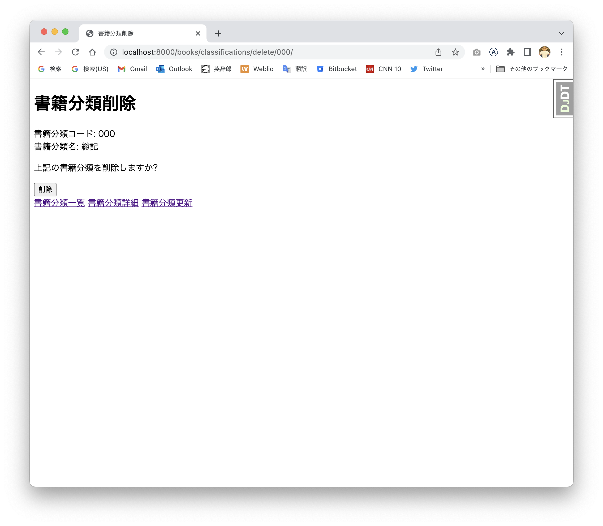

## 書籍分類詳細ページの実装

書籍分類詳細ページを書籍分類ページと同様に実装してください。

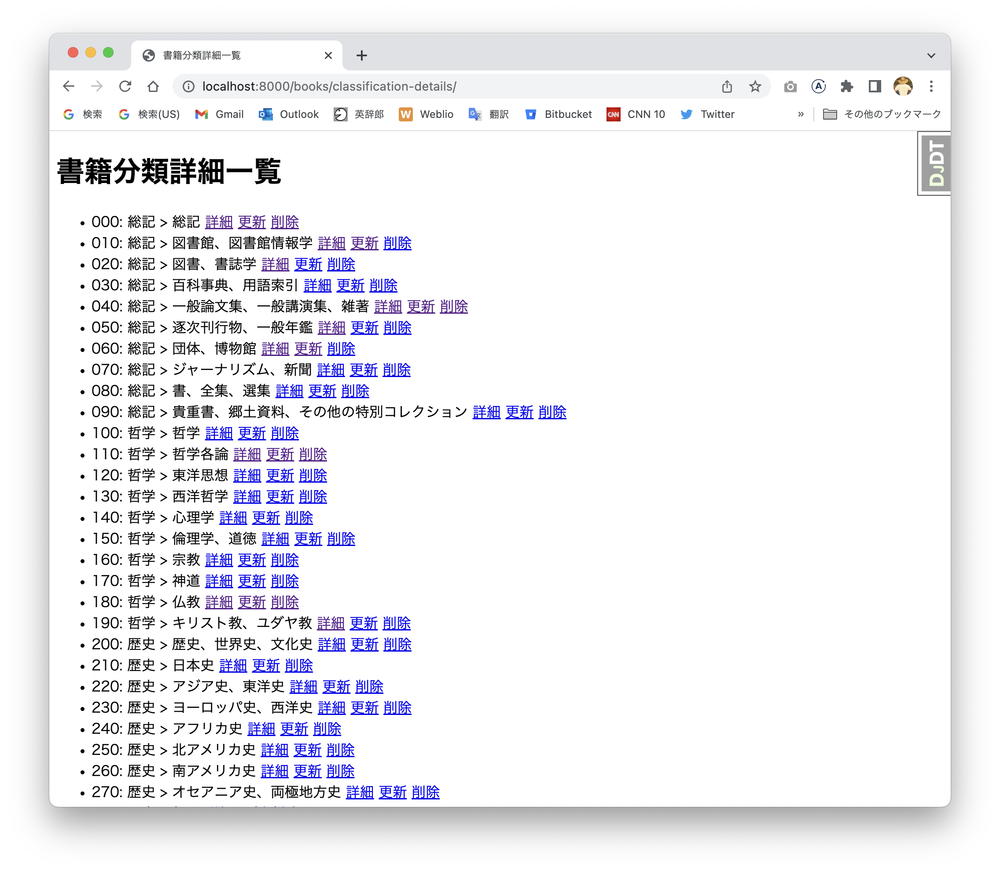

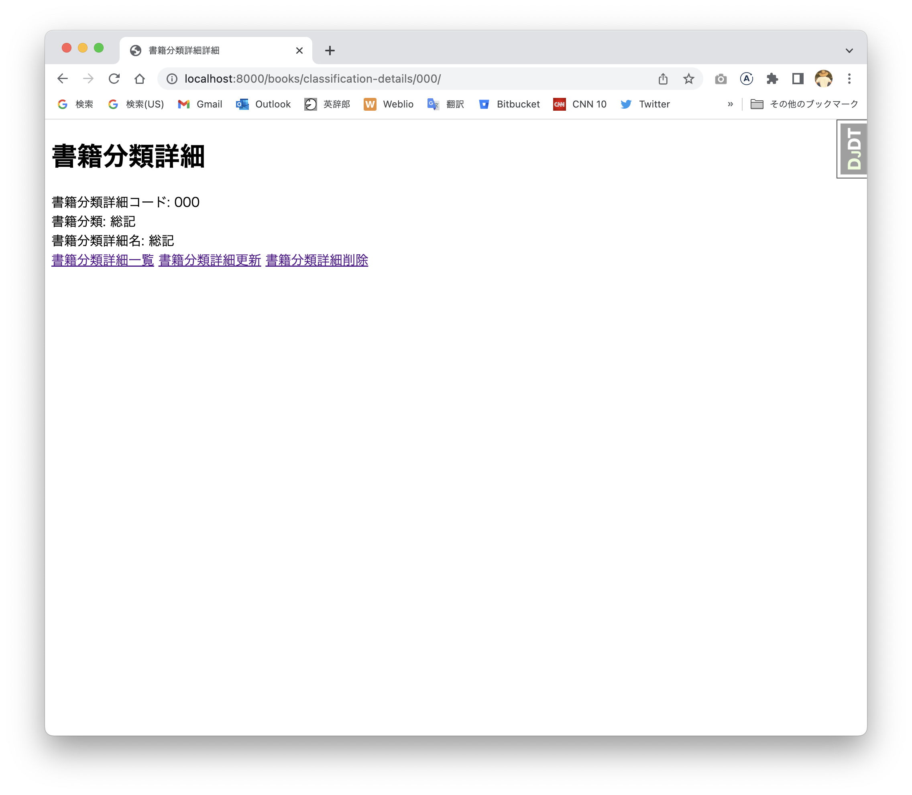

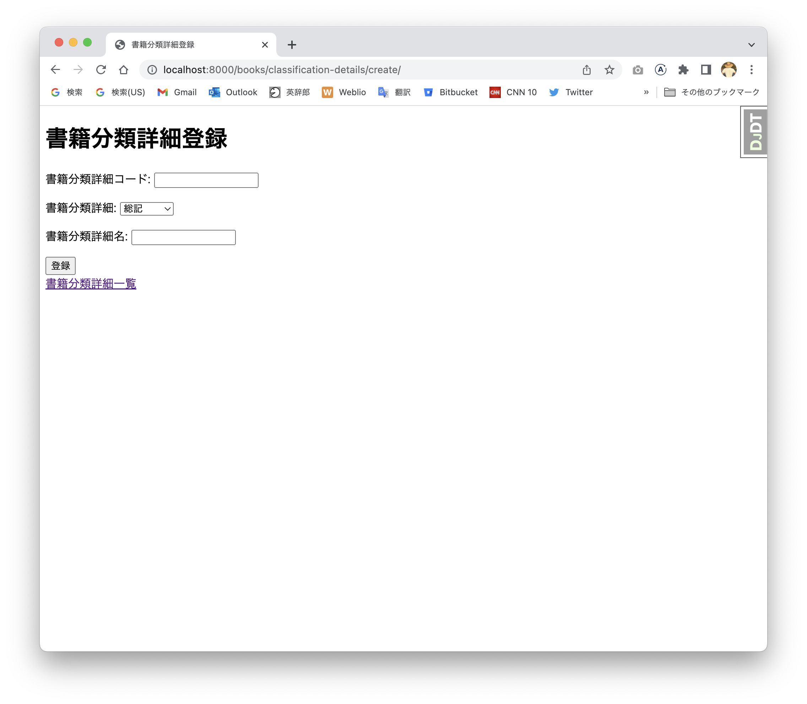

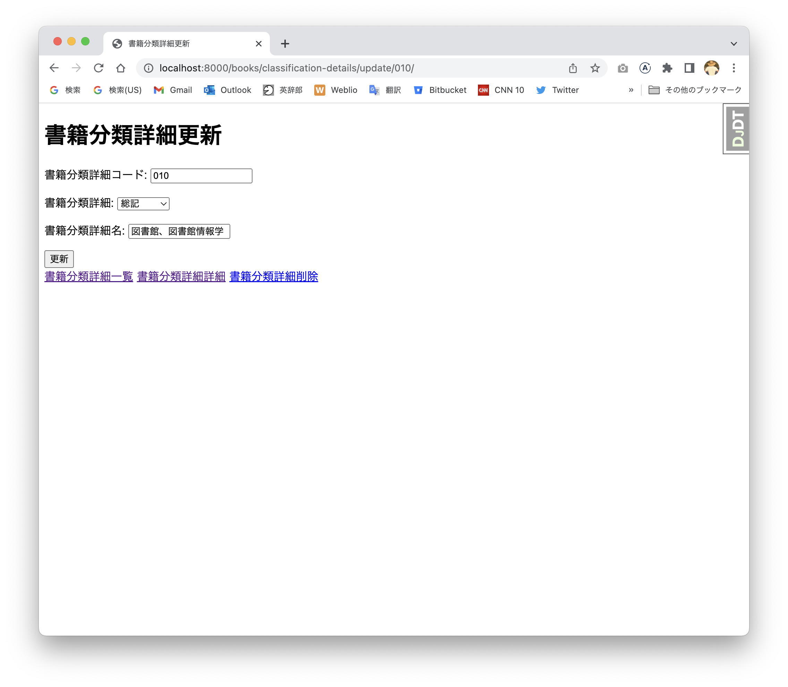

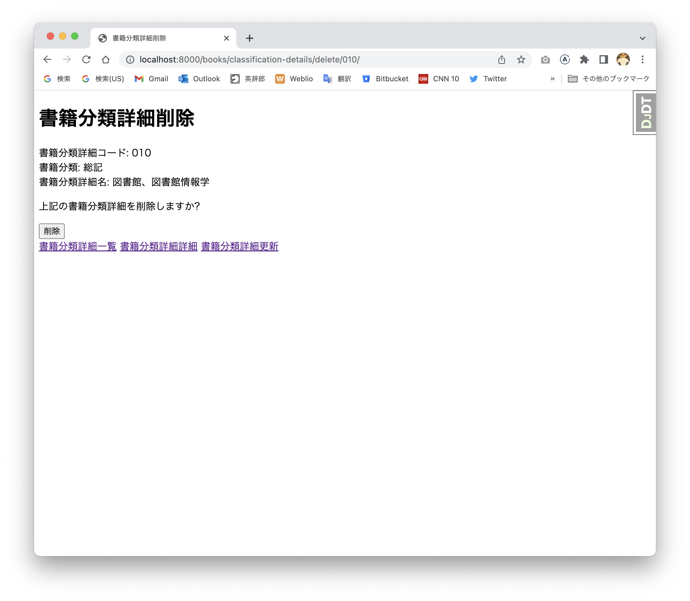

書籍分類詳細ページとリクエストURLの対応を次の通りとします。

- 書籍分類詳細一覧ページ: `/books/classification-details/`
- 書籍分類詳細詳細ページ: `/books/classification-details/<code>`
- 書籍分類詳細登録ページ: `/books/classification-details/create/`
- 書籍分類詳細更新ページ: `/books/classification-details/update/<code>`
- 書籍分類詳細削除ページ: `/books/classification-details/delete/<code>`

書籍分類ページと異なる実装は、本節で説明します。

### 書籍分類詳細一覧ビューの実装

書籍分類詳細一覧ビュー（`ClassificationDetailListView`）を次の通り実装します。

```python
# ./books/views.py
class ClassificationDetailListView(
    ClassificationDetailViewMixin, PageTitleMixin, generic.ListView
):
    """書籍分類詳細一覧クラスビュー"""

    title = "書籍分類詳細一覧"
    context_object_name = "classification_detail_list"
    template_name = "books/classification_detail_list.html"
```

`context_object_name`で書籍分類詳細一覧ビューが取得する書籍分類詳細クエリセットのコンテキスト名を指定しています。
`context_object_name`を指定しない場合、そのコンテキスト名はモデル名を単純に小文字化した文字列の末尾に`_list`を追加した`classificationdetail_list`になります。

`template_name`で書籍分類詳細一覧ビューのテンプレートを指定しています。
`template_name`を指定しない場合、コンテキスト名と同様に`books/classificationdetail_list.html`になります。

### ClassificationDetailSingleObjectMixinの実装

`ClassificationDetailSingleObjectMixin`を次の通り実装します。

```python
# ./books/views.py
class ClassificationDetailSingleObjectMixin:
    """書籍分類詳細シングルオブジェクトミックスイン"""

    pk_url_kwarg = "code"
    context_object_name = "classification_detail"
```

`context_object_name`で特定の書籍分類詳細モデルインスタンスを表示するビューが取得する書籍分類詳細モデルインスタンスのコンテキスト名を指定しています。
`context_object_name`を指定しない場合、そのコンテキスト名は`classificationdetail`になります。

### 書籍分類詳細ビューの実装

書籍分類詳細詳細ビュー（`ClassificationDetailDeleteView`）を次の通り実装します。

```python
class ClassificationDetailDeleteView(
    ClassificationDetailViewMixin,
    ClassificationDetailSingleObjectMixin,
    PageTitleMixin,
    generic.DeleteView,
):
    """書籍分類詳細削除クラスビュー"""

    title = "書籍分類詳細削除"
    template_name = "books/classification_detail_confirm_delete.html"
    success_url = reverse_lazy("classification-detail-list")
```

### ClassificationDetailFormMixinの実装

`ClassificationDetailFormMixin`を次の通り実装します。

```python
# ./books/views.py
class ClassificationDetailFormMixin(generic.edit.ModelFormMixin):
    """書籍分類詳細フォームフィールドミックスイン"""

    fields = ("code", "classification", "name")
    template_name = "books/classification_detail_form.html"

    def get_form(self, form_class: Optional[forms.Form] = None) -> forms.Form:
        form = super().get_form(form_class)
        form.fields["classification"].empty_label = None
        return form
```

上記の通り`get_form`をオーバーライドしない場合、書籍分類詳細フォームの書籍分類ドロップダウンで書籍分類を選択していないことを示す`---------`を選択できます。
書籍分類詳細モデルインスタンスは、書籍分類を必ず入力する必要があるため、`---------`を選択候補から除くために`get_form`をオーバーライドしています（`form.fields["classification"].empty_label = None`）。

### 書籍分類詳細登録、更新及び削除ビューの実装

書籍分類詳細登録（`ClassificationDetailCreateView`）、更新（`ClassificationDetailUpdateView`）及び削除（`ClassificationDetailDeleteView`）は、書籍分類のそれぞれに対応するビューを参考に実装してください。
なお、それぞれのビューでは、テンプレート名を適切に指定してください。

### 変更のコミット

書籍分類詳細ページを実装して、書籍分類詳細ページが正常に機能することが確認できたら、次の通り変更をリポジトリにコミットします。

```bash
git add --all
git commit -m '書籍分類詳細ページを実装
```

 書籍分類詳細ページを実装

> e557597 (tag: 038-implement-classification-detail-page)

## 書籍分類詳細一覧ページで書籍分類詳細を書籍分類でフィルタ

書籍分類詳細一覧ページで、管理サイトと同様に、書籍分類詳細の一覧を書籍分類でフィルタできるようにするために、次のようなリクエストURLを処理できるようにします。

```url
http://localhost:8000/books/classification_details/?classification_code=<code>
```

上記URLの`?`より右が`GETパラメーター`で`<パラメーター>=<値>`という形式になっています。
なお、GETパラメーターは、`&`で繋げて複数設定できます。

上記URLにおいて、本Webアプリケーションは、`classification_code=<code>`の`<code>`を書籍分類コードとして扱います。
書籍分類詳細一覧ページでは、GETパラメーターで指定された書籍分類コードに一致する書籍分類コードを持つ書籍分類詳細のみを表示します。
なお、書籍分類コードが指定されていないとき、または書籍分類コードがどの書籍分類にも一致しない場合は、すべての書籍分類詳細を表示します。

`./books/views.py`のインポート文を次の通り変更します。

```python
# ./books/views.py
- from typing import Type, Optional
+ from typing import Any, Dict, Optional

  from django import forms
+ from django.db.models import QuerySet
+ from django.http import HttpRequest
  from django.urls import reverse, reverse_lazy
  from django.views import generic

  from core.mixins import FormActionMixin, PageTitleMixin

  from .models import Classification, ClassificationDetail
```

その後、次の通り`get_classification_from_param`関数を追加して、書籍分類詳細一覧ビューの実装を置き換えます。

```python
# ./books/views.py
def get_classification_from_param(request: HttpRequest) -> Optional[Classification]:
    """GETパラメータで指定された書籍分類コードから書籍分類モデルインスタンスを取得して返却する。

    Args:
        request: HTTPリクエスト

    Returns
        書籍分類モデルインスタンス。
        GETパラメーターに書籍分類コードが指定されていない場合、またそのパラメータで指定された書籍分類コードと
        一致する書籍分類が存在しない場合はNone。
    """
    # 書籍分類コードを取得
    code = request.GET.get("classification_code", None)
    # 書籍分類コードが指定されていない場合はNoneを返却
    if not code:
        return None

    try:
        # 書籍分類コードから書籍分類モデルインスタンスを取得
        return Classification.objects.get(code=code)
    except Classification.DoesNotExist:
        # 書籍分類コードから書籍分類モデルインスタンスを取得できない場合はNoneを返却
        return None

class ClassificationDetailListView(
    ClassificationDetailViewMixin, PageTitleMixin, generic.ListView
):
    """書籍分類詳細一覧クラスビュー"""

    title = "書籍分類詳細一覧"
    context_object_name = "classification_detail_list"
    template_name = "books/classification_detail_list.html"
    # 書籍分類詳細をフィルタする書籍分類
    classification: Optional[Classification] = None

    def get_queryset(self) -> QuerySet[ClassificationDetail]:
        """書籍分類詳細一覧ページで表示する書籍分類詳細クエリセットを返却する。"""
        self.classification = get_classification_from_param(self.request)
        if not self.classification:
            return ClassificationDetail.objects.all()
        else:
            return ClassificationDetail.objects.filter(
                classification=self.classification
            )

    def get_context_data(self, **kwargs: Any) -> Dict[str, Any]:
        """コンテキストを返却する。

        コンテキストを取得して、コンテキストにすべての書籍分類詳細モデルインスタンスと、
        書籍分類詳細をフィルタする書籍分類モデルインスタンスを登録する。
        """
        # コンテキストを取得
        ctx = super().get_context_data(**kwargs)
        # コンテキストにすべての書籍分類詳細モデルインスタンスを登録
        ctx["classification_list"] = Classification.objects.all()
        # コンテキストに書籍分類詳細をフィルタする書籍分類モデルインスタンスを登録
        ctx["current_classification"] = self.classification
        return ctx
````

書籍分類詳細一覧ページでGETパラメーターで指定された書籍分類で書籍分類詳細をフィルタできるように、書籍分類詳細一覧テンプレートを次で置き換えます。

```html
<!-- ./books/templates/books/classification_detail_list.html -->



  <h1>書籍分類詳細一覧</h1>
  <div>
    
      
        <a href="?classification_code={{ classification.code }}">
          {{ classification.name }}
        </a>&thinsp;
      
        {{ classification.name }}&thinsp;
      
    
    
      <a href="">すべて</a>
    
      すべて
    
  </div>
  
    <ul>
      
        <li>
          {{ classification_detail.code }}: {{ classification_detail.classification }}
          &gt; {{ classification_detail.name }}
          <a href="">詳細</a>
          <a href="">更新</a>
          <a href="">削除</a>
        </li>
      
    </ul>
  
    <p>書籍分類詳細が存在しません。</p>
  
  <a href="">書籍分類詳細登録</a>

```

書籍分類詳細一覧ページに書籍分類詳細を書籍分類でフィルタするリンクが表示されます。
書籍分類リンクをクリックして、書籍分類詳細がクリックした書籍分類でフィルタされることを確認できたら、次の通り変更をリポジトリにコミットします。

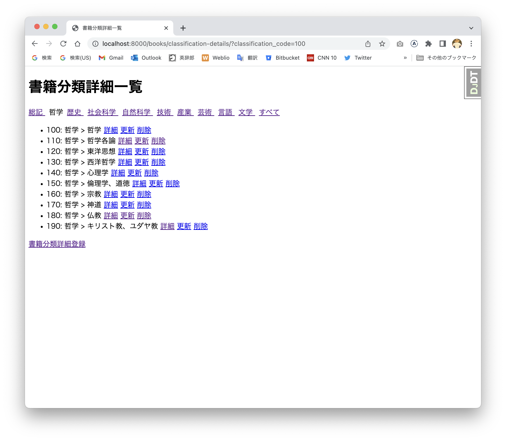

```bash
git add ./books/
git commit -m '書籍分類詳細一覧ページで書籍分類詳細を書籍分類でフィルタできるように実装'
```

> c7602e9 (tag: 039-filter-classification-detail-by-classification)

## 書籍ページの実装

### 書籍一覧ページの実装

書籍一覧ビュー（`BookListView`）を次の通り実装します。
書籍一覧ページも、書籍分類詳細一覧ページと同様に、書籍分類で書籍をフィルタできるようにします。
なお、書籍分類のリンクを表示するテンプレートは、書籍分類詳細一覧ページと共有します。

```python
# ./books/views.py
  from typing import Any, Dict, Optional

  from django import forms
  from django.db.models import QuerySet
  from django.http import HttpRequest
  from django.urls import reverse, reverse_lazy
  from django.views import generic

  from core.mixins import FormActionMixin, PageTitleMixin

- from .models import Classification, ClassificationDetail
+ from .models import Book, Classification, ClassificationDetail
```

```python
# ./books/views.py
class BookViewMixin:
    """書籍ビューミックスイン"""

    model = Book


class BookListView(BookViewMixin, PageTitleMixin, generic.ListView):
    """書籍一覧クラスビュー"""

    title = "書籍一覧"
    classification: Optional[Classification] = None

    def get_queryset(self) -> QuerySet[Book]:
        """書籍一覧ページで表示する書籍クエリセットを返却する。"""
        self.classification = get_classification_from_param(self.request)
        if not self.classification:
            return Book.objects.all()
        else:
            return Book.objects.filter(
                classification_detail__classification=self.classification
            )

    def get_context_data(self, **kwargs: Any) -> Dict[str, Any]:
        """コンテキストを取得して、そのコンテキストにすべての書籍分類モデルインスタンスを登録する。"""
        ctx = super().get_context_data(**kwargs)
        ctx["classification_list"] = Classification.objects.all()
        ctx["current_classification"] = self.classification
        # コンテキストに書籍一覧ページのURLを登録
        ctx["list_page_url"] = reverse("books:book-list")
        return ctx
```

書籍分類リンクテンプレートは、次の通り書籍分類詳細一覧レンプレートから切り取って実装します。

```html
<!-- ./books/templates/books/_classification_links.html -->
<div>
  
    
      <a href="{{ list_page_url }}?classification_code={{ classification.code }}">
        {{ classification.name }}
      </a>&thinsp;
    
      {{ classification.name }}&thinsp;
    
  
  
    <a href="{{ list_page_url }}">すべて</a>
  
    すべて
  
</div>
```

書籍一覧テンプレートを次の通り実装します。
なお、書籍の一覧はHTMLの`table`要素で出力します。

```html
<!-- ./books/templates/books/book_list.html -->



  <h1>書籍一覧</h1>
  
  
    <table>
      <thead>
      <tr>
        <th>タイトル</th>
        <th>分類</th>
        <th>分類詳細</th>
        <th>著者または訳者など</th>
        <th>出版社</th>
        <th>管理部署</th>
        <th>廃棄</th>
        <th/>
      </tr>
      </thead>
      <tbody>
      
        <tr>
          <td>{{ book.title }}</td>
          <td>{{ book.classification_detail.classification }}</td>
          <td>{{ book.classification_detail }}</td>
          <td>{{ book.authors | truncatechars:40 }}ー</td>
          <td>{{ book.publisher | default_if_none:"ー" }}</td>
          <td>{{ book.division }}</td>
          <td>{{ book.disposed | yesno:"済,ー" }}</td>
          <td/>
        </tr>
      
      </tbody>
    </table>
  
    <p>書籍が存在しません。</p>
  

```

テンプレートの`truncatechars`は、表示する文字列を指定された文字数まで出力する`テンプレートフィルタ`です。

また、`yesno`は、左を`True`と評価された場合は右の文字列をカンマ（`,`）で区切ったときの最初の文字列、`False`と評価された場合は2番目の文字列を出力するテンプレートフィルタです。
なお、オプションで`None`と評価された場合は3番目の文字列を出力します。

> Djangoにビルトインされているテンプレートフィルタについては、[ここ](https://docs.djangoproject.com/en/4.2/ref/templates/builtins/#built-in-filter-reference)を参照してください。

書籍分類詳細一覧ビューを次の通り変更します。

```python
  class ClassificationDetailListView(
      ClassificationDetailViewMixin, PageTitleMixin, generic.ListView
  ):
      """書籍分類詳細一覧クラスビュー"""

  (...省略...)

      def get_context_data(self, **kwargs: Any) -> Dict[str, Any]:

  (...省略...)
          # コンテキストに書籍分類詳細をフィルタする書籍分類モデルインスタンスを登録
          ctx["current_classification"] = self.classification
+         # コンテキストに書籍分類詳細一覧ページのURLを登録
+         ctx["list_page_url"] = reverse("books:classification-detail-list")
          return ctx
```

書籍分類詳細一覧テンプレートを次の通り変更します。

```html
<!-- ./books/templates/books/classification_detail_list.html -->
  
    <h1>書籍分類詳細一覧</h1>
-   <div>
-     
-       
-         <a href="?classification_code={{ classification.code }}">
-           {{ classification.name }}
-         </a>&thinsp;
-       
-         {{ classification.name }}&thinsp;
-       
-     
-     
-       <a href="">すべて</a>
-     
-       すべて
-     
-   </div>
+   
    
```

書籍一覧ビューをディスパッチするために、書籍アプリのURLconfに次を追加します。

```python
# ./books/urls.py
    # 書籍一覧ページ (ex: /books/)
    path("", views.BookListView.as_view(), name="book-list"),
```

開発サーバーを起動後、書籍一覧ページと書籍分類詳細一覧ページが正常に表示され、書籍分類によるフィルタが機能したら、次の通り変更をリポジトリにコミットします。

```bash
git add ./books/
git commit -m '書籍一覧ページを実装'
```

> 1154965 (tag: 040-implement-book-list-page)

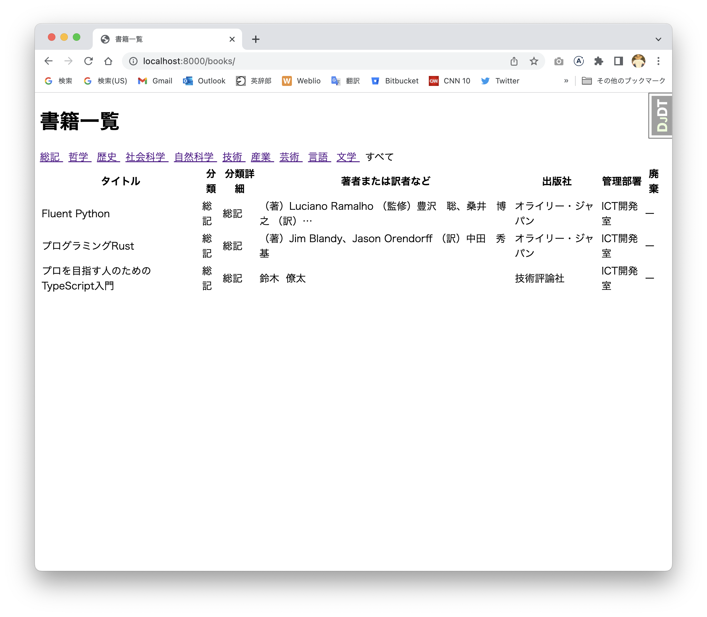

### 書籍詳細ページの実装

書籍詳細ビューを次の通り実装します。

```python
# ./books/views.py
class BookDetailView(
    BookViewMixin,
    PageTitleMixin,
    generic.DetailView,
):
    """書籍詳細クラスビュー"""

    title = "書籍詳細"
```

書籍詳細ページでは、書籍の詳細を`table`要素で表示します。
この`table`要素は、後で実装する書籍削除テンプレートにも表示するため、次の通り書籍詳細表示テンプレートに実装してインクルード(`include`)します。

```html
<!-- ./books/templates/books/_book_detail.html -->
<table>
  <tr>
    <th>タイトル</th>
    <td>{{ book.title }}</td>
  </tr>
  <tr>
    <th>分類</th>
    <td>{{ book.classification_detail.classification }}</td>
  </tr>
  <tr>
    <th>分類詳細</th>
    <td>{{ book.classification_detail }}</td>
  </tr>
  <tr>
    <th>著者または訳者</th>
    <td>{{ book.authors }}ー
  </tr>
  <tr>
    <th>ISBN</th>
    <td>{{ book.isbn | default_if_none:"ー" }}</td>
  </tr>
  <tr>
    <th>出版社</th>
    <td>{{ book.publisher | default_if_none:"ー" }}</td>
  </tr>
  <tr>
    <th>発行日</th>
    <td>{{ book.published_at | default_if_none:"ー" }}</td>
  </tr>
  <tr>
    <th>管理部署</th>
    <td>{{ book.division }}</td>
  </tr>
  <tr>
    <th>廃棄</th>
    <td>{{ book.disposed | yesno:"済,ー" }}</td>
  </tr>
  
    <tr>
      <th>廃棄日</th>
      <td>{{ book.disposed_at }}</td>
    </tr>
  
  <tr>
    <th>登録日時</th>
    <td>{{ book.created_at }}</td>
  </tr>
  <tr>
    <th>更新日時</th>
    <td>{{ book.updated_at }}</td>
  </tr>
</table>
```

書籍詳細テンプレートを次の通り実装します。

```html
<!-- ./books/templates/books/book_detail.html -->



  <h1>書籍詳細</h1>
  
  <div>
    <a href="">書籍一覧</a>
  </div>

```

書籍詳細ビューをディスパッチするために、書籍アプリのURLconfに次を追加します。

```python
    # 書籍詳細ページ (ex: /books/<id>/)
    path("<str:pk>/", views.BookDetailView.as_view(), name="book-detail"),
```

また、書籍一覧テンプレートに書籍詳細ページへのリンクを追加します。

```html
<!-- ./books/templates/books/book_list.html -->
        
          <tr>
            <td>{{ book.title }}</td>
            <td>{{ book.classification_detail.classification }}</td>
            <td>{{ book.classification_detail }}</td>
            <td>{{ book.authors | truncatechars:40 }}ー</td>
            <td>{{ book.publisher | default_if_none:"ー" }}</td>
            <td>{{ book.division }}</td>
            <td>{{ book.disposed | yesno:"済,ー" }}</td>
-           <td />
+           <td>
+             <a href="">詳細</a>
+           </td>
          </tr>
        
```

開発サーバーを起動して、ブラウザで書籍一覧ページにアクセスした後、書籍詳細ページへのリンクをクリックして書籍詳細ページが正常に表示されるか確認します。
書籍詳細ページが正常に表示されたら、次の通り変更をリポジトリにコミットします。

```bash
git add ./books/
git commit -m '書籍詳細ページを実装'
```

> ce435d3 (tag: 041-implement-book-detail-page)

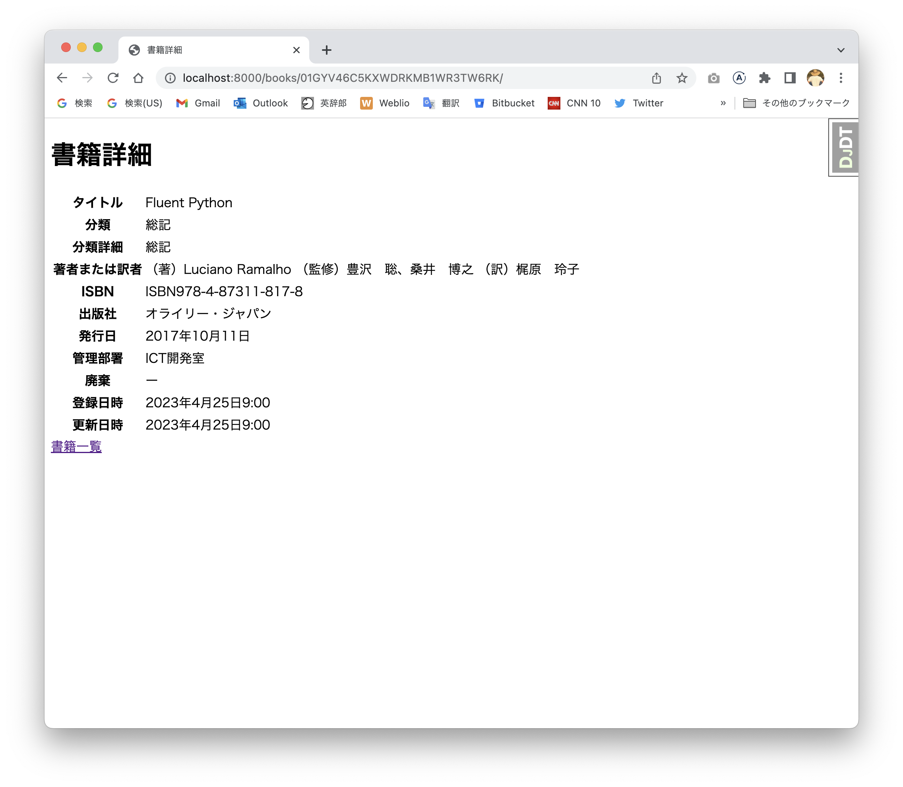

### 書籍フォームの実装

`./books/form.py`ファイルを作成して、次の通り書籍フォームを実装します。
書籍フォームは、書籍モデルのモデルフィールドに対応しない、書籍分類フォームフィールドを追加します。
書籍分類フォームフィールドは、書籍フォームの書籍分類詳細フォームフィールドの選択肢を、書籍分類フォームフィールドに入力された書籍分類でフィルタするために使用します。

```python
# ./books/forms.py
from django import forms

from .models import Book, Classification


class BookForm(forms.ModelForm):
    """書籍フォーム"""

    classification = forms.ModelChoiceField(
        label="書籍分類", queryset=Classification.objects.all(), empty_label=None
    )

    class Meta:
        model = Book
        fields = (
            "title",
            "classification",
            "classification_detail",
            "authors",
            "isbn",
            "publisher",
            "published_at",
            "division",
            "disposed",
            "disposed_at",
        )

    def __init__(self, *args, **kwargs) -> None:
        """イニシャライザ"""
        super().__init__(*args, **kwargs)
        self.fields["classification_detail"].empty_label = None
        self.fields["division"].empty_label = None
```

書籍フォームテンプレートを次の通り実装します。
書籍フォームテンプレートに実装されたJavaScriptの実装内容については、コメントを確認してください。
なお、JavaScriptの一部は、Djangoがレンダリングするようになっています。

```html
<!-- ./books/templates/books/book_form.html -->



  <h1>書籍{{ action }}</h1>
  <form method="post">
     {{ form.as_p }}
    <button type="submit">{{ action }}</button>
  </form>
  <div>
    <a href="">書籍一覧</a>
  </div>
  <script>
    //
    // 書籍分類詳細の選択肢を選択された書籍分類でフィルタする処理をJavaScriptで実装
    //
    // すべての書籍分類詳細のJSON表現
    // safeテンプレートフィルタで、DjangoがJSON表現をレンダリングするときにXSS攻撃などを防ぐための無害化処理（サニタイズ）を無効化
    const classificationDetails = {{ classification_details | safe }};

    // 書籍分類詳細の選択肢を設定する関数
    const setClassificationDetailOptions = () => {
      // 書籍分類フォームフィールド（select要素）で選択された書籍分類の書籍分類コードを取得
      // getElementById関数は、引数で指定されたid属性を持つHTML要素を検索
      // 次のコードは、取得した書籍分類フォームフィールドで選択された書籍分類の書籍分類コードを取得
      // <field>.auto_idは、Djangoがフォームフィールドに設定するid属性の値
      const code = document.getElementById("{{ form.classification.auto_id }}").value;
      // すべての書籍分類詳細から上記で取得した書籍分類コードを持つ書籍分類詳細を抽出
      const filteredDetails = classificationDetails.filter(cd => cd.classification === code);
      // 書籍分類詳細フォームフィールドを取得
      const select = document.getElementById("{{ form.classification_detail.auto_id }}");
      // 書籍分類詳細フォームフィールドの子要素をすべて削除
      while (select.firstChild) {
        select.removeChild(select.lastChild);
      }
      // 書籍分類詳細フォームフィールド（select要素）に選択肢をoption要素として追加
      filteredDetails.forEach(detail => {
        let option = document.createElement("option");
        option.value = detail.code;
        option.textContent = detail.name;
        select.appendChild(option);
      });
    }

    // ページがロードされた後に実行される関数を登録
    window.onload = () => {
      setClassificationDetailOptions();
    }

    // 書籍分類フォームフィールドの選択が変更された後に実行する関数を登録
    document.getElementById("{{ form.classification.auto_id }}")
        .addEventListener("change", (ev) => {
          setClassificationDetailOptions();
        });
  </script>

```

### 書籍登録ページの実装

書籍登録ビューを次の通り実装します。

```python
# ./books/views.py
  from core.mixins import FormActionMixin, PageTitleMixin

+ from .forms import BookForm
  from .models import Book, Classification, ClassificationDetail
```

```python
# ./books/views.py
class BookCreateView(
    BookViewMixin,
    PageTitleMixin,
    FormActionMixin,
    generic.CreateView,
):
    """書籍登録ビュー"""

    form_class = BookForm
    title = "書籍登録"
    action = "登録"

    def get_context_data(self, **kwargs: Any) -> Dict[str, Any]:
        ctx = super().get_context_data(**kwargs)
        ctx["classification_details"] = list(
            ClassificationDetail.objects.all().values("code", "classification", "name")
        )
        return ctx

    def get_success_url(self) -> str:
        return reverse("books:book-detail", kwargs={"pk": self.object.id})
```

書籍一覧ページに書籍登録ページへのリンクを設置するために、書籍一覧テンプレートを次の通り変更します。

```html
<!-- ./books/templates/books/book_list.html -->
    
      <p>書籍が存在しません。</p>
    
+   <div>
+     <a href="">書籍登録</a>
+   </div>
  
```

書籍詳細ページに書籍登録ページへのリンクを設置するために、書籍詳細テンプレートを次の通り変更します。

```html
<!-- ./books/templates/books/book_detail.html -->
    <div>
      <a href="">書籍一覧</a>
+     <a href="">書籍登録</a>
    </div>

```

書籍登録ビューを書籍詳細ビューの上の行でディスパッチします。

```python
# ./books/urls.py
      # 書籍一覧ページ (ex: /books/)
      path("", views.BookListView.as_view(), name="book-list"),
+     # 書籍登録ページ (ex: /books/create/)
+     path("create/", views.BookCreateView.as_view(), name="book-create"),
      # 書籍詳細ページ (ex: /books/<id>/)
      path("<str:pk>/", views.BookDetailView.as_view(), name="book-detail"),
```

書籍登録ページで正常に書籍を登録できたら、次の通り変更をリポジトリにコミットします。

> 書籍フォームテンプレートに実装したJavaScriptコードの`classificationDetails`変数の値のレンダリング結果を、ChromeのDevToolなどで確認してください。

```bash
git add ./books/
git commit -m '書籍登録ビューを実装'
```

> 3493107 (tag: 042-implement-book-create-page)

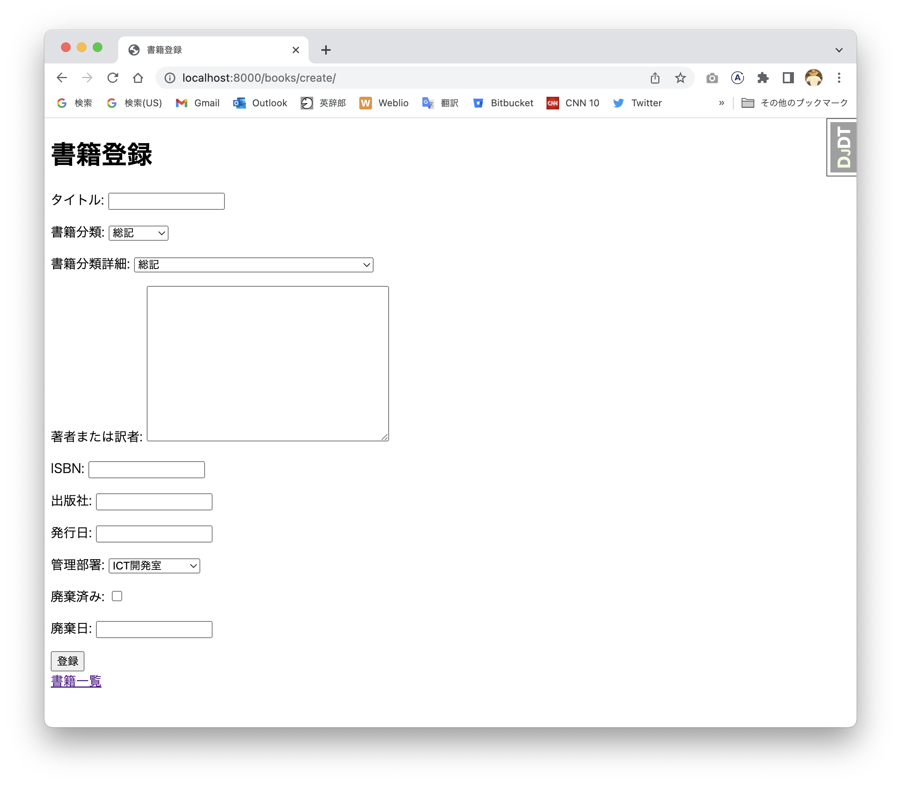

### 書籍更新ページの実装

書籍更新ビューを次の通り実装します。

```python

class BookUpdateView(
    BookViewMixin,
    PageTitleMixin,
    FormActionMixin,
    generic.UpdateView,
):
    """書籍更新ビュー"""

    form_class = BookForm
    title = "書籍更新"
    action = "更新"

    def get_initial(self) -> Dict[str, Any]:
        initial = super().get_initial()
        initial["classification"] = self.object.classification_detail.classification
        return initial

    def get_context_data(self, **kwargs: Any) -> Dict[str, Any]:
        ctx = super().get_context_data(**kwargs)
        ctx["classification_details"] = list(
            ClassificationDetail.objects.all().values("code", "classification", "name")
        )
        return ctx

    def get_success_url(self) -> str:
        return reverse("books:book-detail", kwargs={"pk": self.object.id})
```

書籍フォームテンプレートを次の通り2箇所変更します。

```html
    <div>
      <a href="">書籍一覧</a>
+     
+       <a href="">書籍詳細</a>
+     
    </div>

  (...省略...)

      // ページがロードされた後に実行される関数を登録
      window.onload = () => {
        setClassificationDetailOptions();
+       // 書籍分類詳細フォームフィールドを取得
+       const select = document.getElementById("{{ form.classification_detail.auto_id }}");
+       // 書籍更新ページの場合は、setClassificationDetailOption関数によって、書籍の書籍分類詳細がクリアされるため
+       // 書籍分類詳細を再設定
+       if ("{{ action }}" === "更新") {
+         select.value = "{{ book.classification_detail.code }}";
+       }
      }
```

書籍一覧ページに書籍更新ページへのリンクを設置するために、書籍一覧テンプレートを次の通り変更します。

```html
<!-- ./books/templates/books/book_list.html -->
            <td>
              <a href="">詳細</a>
+             <a href="">更新</a>
            </td>
```

書籍詳細ページに書籍更新ページへのリンクを設置するために、書籍詳細テンプレートを次の通り変更します。

```html
<!-- ./books/templates/books/book_detail.html -->
    <div>
      <a href="">書籍一覧</a>
      <a href="">書籍登録</a>
+     <a href="">書籍更新</a>
    </div>
```

書籍更新ビューをディスパッチするために、書籍アプリのURLconfに次を追加します。

```python
    # 書籍更新ページ (ex: /books/update/<id>/)
    path("update/<str:pk>/", views.BookUpdateView.as_view(), name="book-update"),
```

書籍更新ページで正常に書籍を更新できたら、次の通り変更をリポジトリにコミットします。

```bash
git add --all
git commit -m '書籍更新ページを実装'
```

> 4725ac7 (tag: 043-implement-book-update-page)

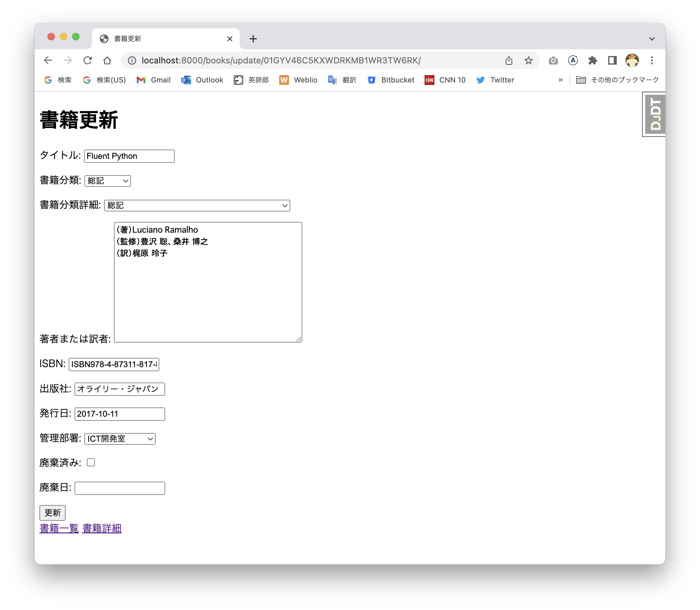

### 書籍削除ページの実装

書籍削除ビューを次の通り実装します。

```python
# ./books/views.py
class BookDeleteView(
    BookViewMixin,
    PageTitleMixin,
    generic.DeleteView,
):
    """書籍削除ビュー"""

    title = "書籍削除"
    success_url = reverse_lazy("books:book-list")
```

書籍削除テンプレートを次の通り実装します。

```html
<!-- ./books/templates/books/book_confirm_delete.html -->



  <h1>書籍削除</h1>
  <p>この書籍を削除しますか?</p>
  <form method="post">
    
    
    <button type="submit">削除</button>
  </form>
  <div>
    <a href="">書籍一覧</a>
    <a href="">書籍詳細</a>
    <a href="">書籍更新</a>
  </div>

```

書籍一覧ページから書籍削除ページへのリンクを次の通り設置します。

```html
<!-- books/templates/books/book_list.html -->
            <td>
              <a href="">詳細</a>
              <a href="">更新</a>
+             <a href="">削除</a>
            </td>
```

書籍詳細ページから書籍削除ページへのリンクを次の通り設置します。

```html
<!-- books/templates/books/book_detail.html -->
    <div>
      <a href="">書籍一覧</a>
      <a href="">書籍登録</a>
      <a href="">書籍更新</a>
+     <a href="">書籍削除</a>
    </div>
```

書籍更新ページから書籍削除ページへのリンクを次の通り設置します。

```html
<!-- books/templates/books/book_update.html -->
      <a href="">書籍一覧</a>
      
        <a href="">書籍詳細</a>
+       <a href="">書籍削除</a>
      
```

書籍削除ビューをディスパッチするために、書籍アプリのURLconfに次を追加します。

```python
# ./books/urls.py
      path("<str:pk>/", views.BookDetailView.as_view(), name="book-detail"),
      # 書籍更新ページ (ex: /books/update/<id>/)
      path("update/<str:pk>/", views.BookUpdateView.as_view(), name="book-update"),
+     # 書籍削除ページ (ex: /books/book/<id>/)
+     path("delete/<str:pk>/", views.BookDeleteView.as_view(), name="book-delete"),
  ]
```

書籍削除ページで正常に書籍を削除できたら、次の通り変更をリポジトリにコミットします。

```bash
git add ./books/
git commit -m '書籍削除ページを実装'
```

> dd8f122 (tag: 044-implement-book-delete-page)

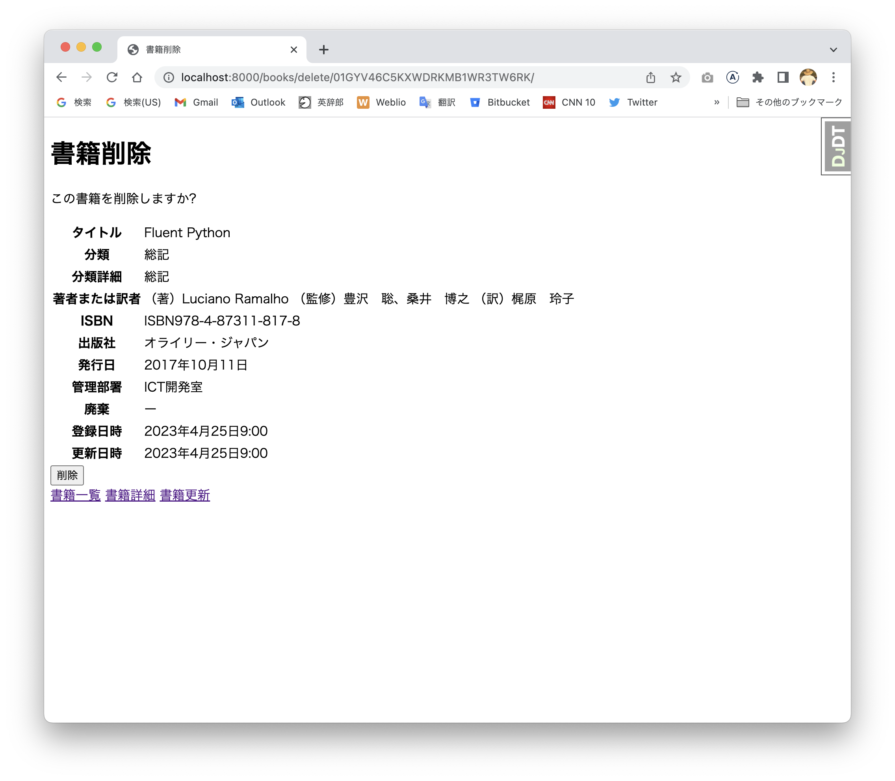

## トランザクション

それぞれのモデルインスタンスの登録、更新及び削除をアトミックにするためにトランザクションを次の通り設定します。

次は、書籍登録ビューでトランザクションを実行するコードですが、書籍更新及び書籍削除ビューでも同様に実装します。

```python
# ./books/views.py
  from typing import Any, Dict, Optional

  from django import forms
+ from django.db import transaction
  from django.db.models import QuerySet
- from django.http import HttpRequest
+ from django.http import HttpRequest, HttpResponse
  from django.urls import reverse, reverse_lazy
  from django.views import generic

(...省略...)

  class BookCreateView(
      BookViewMixin,
      PageTitleMixin,
      FormActionMixin,
      generic.CreateView,
  ):
      """書籍登録ビュー"""

      form_class = BookForm
      title = "書籍登録"
      action = "登録"

+     @transaction.atomic
+     def post(self, request: HttpRequest, *args: str, **kwargs: Any) -> HttpResponse:
+         return super().post(request, *args, **kwargs)
+
      def get_context_data(self, **kwargs: Any) -> Dict[str, Any]:
          ctx = super().get_context_data(**kwargs)
          ctx["classification_details"] = list(
              ClassificationDetail.objects.all().values("code", "classification", "name")
          )
          return ctx

      def get_success_url(self) -> str:
          return reverse("book-detail", kwargs={"pk": self.object.id})
```

`@transaction.atomic`は`デコレーター｀です。
デコレーターは、関数やメソッドをラップ（`wrap`、覆って）、ラップした関数またはメソッドを実行する前または後で、何らかの処理を実行できます。

上記において`@transaction.atomic`デコレーターは、ラップした`post`メソッドを実行する前にトランザクションを開始して、`post`メソッドの実行が終了した後にトランザクションをコミットまたはロールバックします。

トランザクジョンを設定後、書籍登録、更新及び削除ページが正常に機能したら、次の通り変更をリポジトリにコミットします。

```bash
git add ./books/views.py
git commit -m '書籍登録、更新及び削除ページにトランザクションを開始して、書籍の操作をアトミック化'
```

> 4790ca4 (tag: 045-set-transaction-at-book-pages)

### デコレーター

次のコードにおいて、`deco`関数は、`func`仮引数で関数を受け取り、受け取った`func`を実行する前または後で標準出力に文字列を出力するデコレーターです。

```python
def deco(func):
    def wrapper(*args, **kwargs):
        print("-- deco start --")
        func(*args, **kwargs)
        print("-- deco end --")
    return wrapper

@deco
def test():
    print("Hello, decorator")
```

`deco`関数内で定義されている`wrapper`関数は、標準出力に`-- deco start --`を出力して、次に`deco`関数が受け取った`func`を実行して、最後に標準出力に`-- deco end --`を出力する`関数`です。
そして、`deco`関数は、その`wrapper`関数を返却します。

よって、`@deco`で修飾された関数全体が、`deco`関数が返却する関数に置き換わり、`test`関数の呼び出しは`deco`関数内の`wrapper`関数の実行になります。
`@deco`で修飾された`test`関数を呼び出すと、次が出力されます。

```python
test()
# -- deco start --
# Hello, decorator!
# -- deco end --
```

Pythonの関数は、[ファーストクラスオブジェクト（第1級オブジェクト）](https://ja.wikipedia.org/wiki/%E7%AC%AC%E4%B8%80%E7%B4%9A%E3%82%AA%E3%83%96%E3%82%B8%E3%82%A7%E3%82%AF%E3%83%88)であり、[高階関数](https://ja.wikipedia.org/wiki/%E9%AB%98%E9%9A%8E%E9%96%A2%E6%95%B0)でもあります。
この点において、C言語の関数はポインタであるため、C言語の関数はファーストクラスオブジェクトでもなければ、高階関数でもありません。

> **ファーストクラスオブジェクト（第1級オブジェクト）**
>
> 変数に格納できて、また関数の引数に渡せるオブジェクトのことです。
> デコレーターの説明で示した`deco`関数は、関数を引数で受け取ります。
> Pythonの関数は、変数に格納できたり、関数の引数として渡したりできるためファーストクラスオブジェクトです。
>
> **高階関数**
>
> 関数を引数で受け取ったり、関数を返却したりする関数のことです。
> `deco`関数は関数を引数で受け取り、関数を返却するため高階関数です。

Pythonのデコレーターをより理解するために、[Pythonのデコレータを理解するための12Step](https://qiita.com/_rdtr/items/d3bc1a8d4b7eb375c368)を参照してください。

## まとめ

本章では、書籍を一覧及び詳細表示するページと、書籍を登録、更新及び削除するページをクラスビューで実装しました。
また、書籍を`CUD`するページでは、トランザクションを設定して、書籍の操作をアトミックにしました。

次の章は、本章で実装した書籍ページを[Bootstrap](https://getbootstrap.jp/)を使用して装飾及びレイアウトします。
