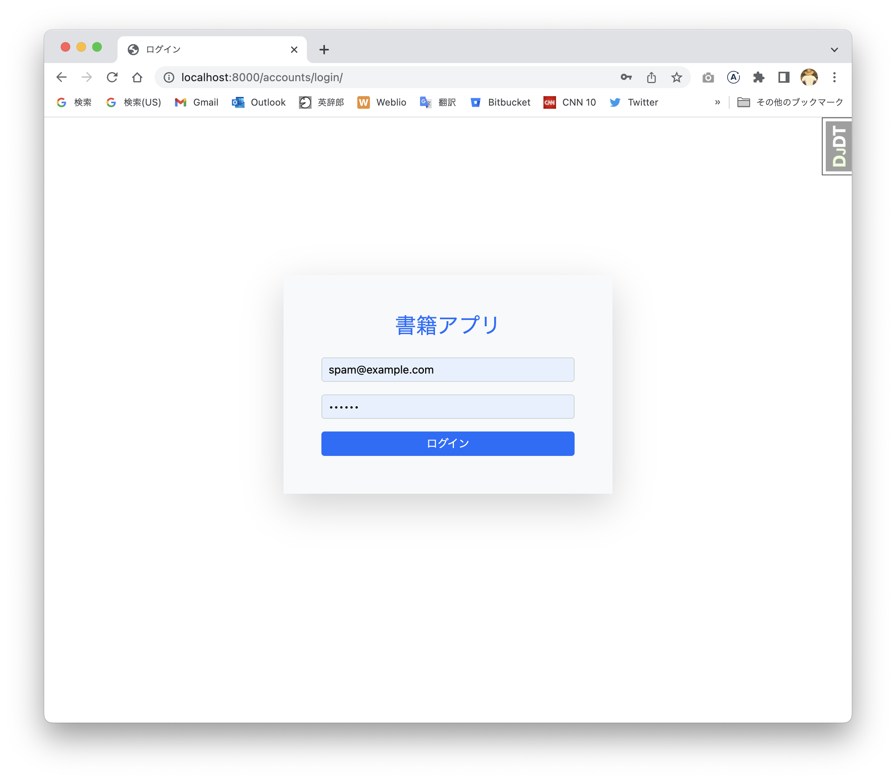
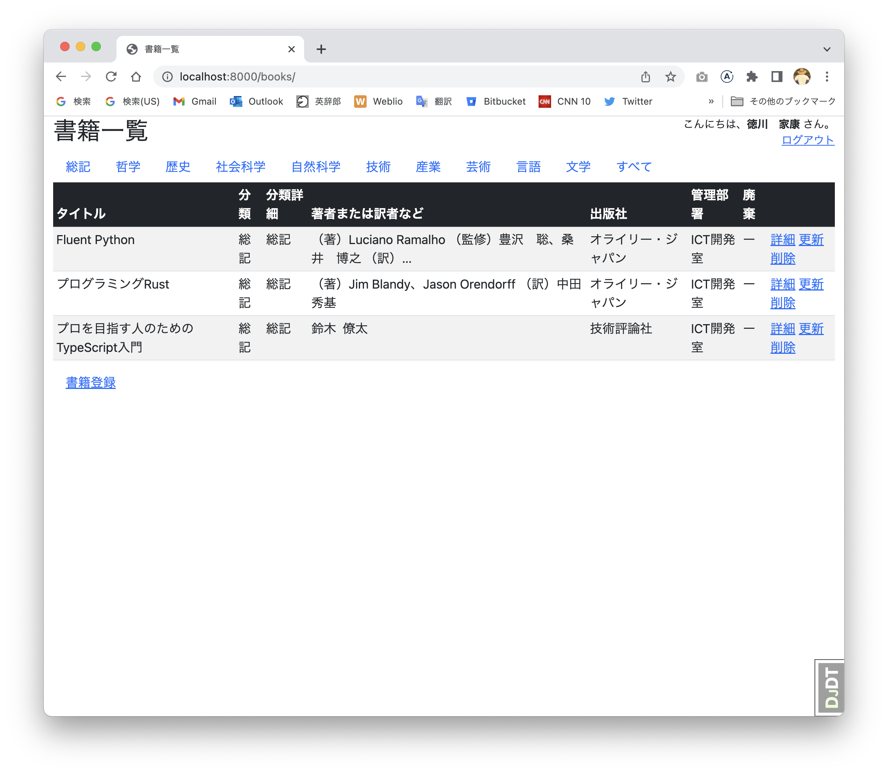
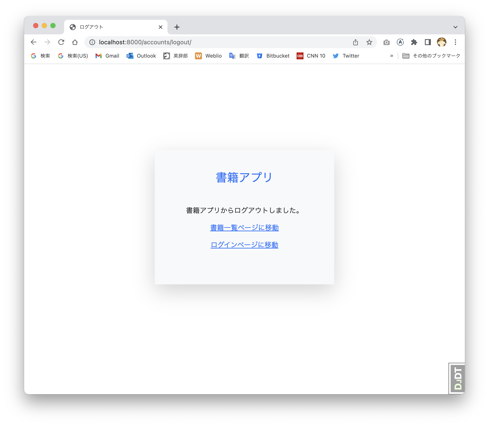
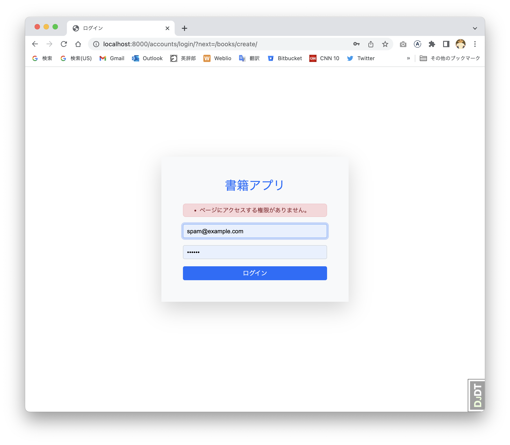

# 認証

- [認証](#認証)
  - [アカウントアプリの追加](#アカウントアプリの追加)
  - [独自ユーザーモデルの実装](#独自ユーザーモデルの実装)
  - [ユーザーモデルを管理サイトに追加](#ユーザーモデルを管理サイトに追加)
  - [ログイン機能とログインページの実装](#ログイン機能とログインページの実装)
  - [ログアウト機能とログアウトページの実装](#ログアウト機能とログアウトページの実装)
  - [書籍ページヘッダにユーザーの名前とログイン及びログアウトリンクの表示](#書籍ページヘッダにユーザーの名前とログイン及びログアウトリンクの表示)
  - [アクセス制限の実装](#アクセス制限の実装)
    - [独自のLoginRequiredMixinの実装](#独自のloginrequiredmixinの実装)
    - [書籍登録、更新及び削除ページのアクセス制限](#書籍登録更新及び削除ページのアクセス制限)
    - [書籍一覧及び書籍詳細ページのリンクの整理](#書籍一覧及び書籍詳細ページのリンクの整理)
  - [まとめ](#まとめ)

Djangoは、`django.contrib.auth.models.User`でユーザーモデルを提供しています。
また、デフォルトでDjangoは、ユーザーが認証されている状態を維持するためにクッキーにセッションを記録します。

> **Webアプリケーションにおけるセッションとは**
>
> Webアプリケーションにおけるセッションとは、一定期間、ブラウザなどのクライアントとWebアプリケーションで維持される`状態`を示します。
> 具体的には、ユーザーがWebアプリケーションにログインしてから、ログアウトするまでの間、ユーザーの行動を追跡するためなどに使用されます。
> 通常、Webアプリケーションは、複数のブラウザとの間に確立されるセッションを、クッキーに記録した情報で識別します。
> セッションが確立されると、ユーザー別にユーザーの行動や入力情報などのデータをWebアプリケーションに保存でき、次回アクセス時にクッキーに記録した情報から保存したデータを取得できます。
> これにより、ユーザーは認証せずにWebアプリケーションにログインできるなど、Webアプリケーションのユーザー体験を向上できます。
> ただし、セッションは有効期限を設定することが一般的であり、ブラウザを閉じる、またはセッションの有効期限を超過するなどするとセッションが失われます。

Djangoが提供するユーザーモデルは、ユーザー名（`username`）モデルフィールドが含まれています。
しかし、ユーザーの識別にEメールアドレスを使用する本Webアプリケーションにとって、ユーザー名は必要ありません。

よって、本Webアプリケーションは、独自のユーザーモデルを定義します。

Djangoが提供する機能を最大限に利用して独自ユーザーモデルを定義する場合、通常、Userモデルが継承する`django.contrib.auth.models.AbstractUser`または、`django.contrib.auth.models.AbstractBaseUser`を継承して独自ユーザーモデルを実装します。

`AbstractBaseUser`は、認証機能などを提供しており、`password`及び`last_login`モデルフィールドを持っています。
なお、名前が`password`となっていますが、Djangoはパスワードをそのままデータベースに記録しません。
`password`フィールドは、パスワードに`ソルト（塩）`と呼ばれるランダムな文字列を追加した文字列に対して、繰り返しハッシュ化した値を記録しています。
これにより、データベースがハッキングされても、そのハッシュ値からパスワードを生成することを難しくしています。
この理由で、スーパーユーザーまたはスタッフでも、ユーザーのパスワードを知ることができません。

> **ハッシュ化とは**
>
> ハッシュ化とは、ハッシュ関数と呼ばれる特殊なアルゴリズムを使用して、任意の長さのデータから`ハッシュ値`と呼ばれる固定長のデータを生成する処理です。
> ハッシュ関数によって生成されるハッシュ値は、入力データの内容に基づいて決定されます。
> 同じ入力に対しては、必ず同じハッシュ値が生成されますが、異なる入力に対しては異なるハッシュ値が生成されます。
> ハッシュ関数は、データがほんの少しだけ違っても、大きく異なるハッシュ値を生成する特性を持っています。
> よって、たった1ビット`0`から`1`に変更してもハッシュ値が大きく異なるため、1ビットずつデータを変更していくような総当たり方式でも、ハッシュ化前のデータを得ることは非常に困難です。

`AbstractUser`は`AbstractBaseUser`を継承しており、`AbstractBaseUser`が持つモデルフィールドに加えて次のモデルフィールドを持っています。

- `username`
- `first_name`
- `last_name`
- `email`
- `is_staff`
- `is_active`
- `data_joined`

独自ユーザーモデルを実装するとき、`AbstractUser`が持っているモデルフィールドが妥当で、独自モデルフィールドを追加したい場合は、`AbstractUser`を継承した独自ユーザーモデルを実装します。
逆に、`AbstractUser`が持っているモデルフィールドが妥当でない場合は、`AbstractBaseUser`を継承した独自ユーザーモデルを実装します。

本アプリケーションは、`AbstractUser`の`username`モデルフィールドを必要としないため、`AbstractBaseUser`を継承した独自ユーザーモデルを実装します。
なお、独自ユーザーモデルの実装は、[ここ](https://dev.to/joshwizzy/customizing-django-authentication-using-abstractbaseuser-llg)を参考にしました。

## アカウントアプリの追加

独自ユーザーモデルを実装するアカウントアプリを次の通り追加します。

```bash
python manage.py startapp accounts
```

`AccountsConfig`を次の通り変更します。

```python
# ./accounts/apps.py
  from django.apps import AppConfig


  class AccountsConfig(AppConfig):
      default_auto_field = "django.db.models.BigAutoField"
      name = "accounts"
+     verbose_name = "アカウントアプリ"
```

プロジェクト設定ファイルの`INSTALLED_APPS`を次の通り変更します。

```python
# ./book_management/settings.py
  INSTALLED_APPS = [
      "django.contrib.admin",
      "django.contrib.auth",
      "django.contrib.contenttypes",
      "django.contrib.sessions",
      "django.contrib.messages",
      "django.contrib.staticfiles",
      "django_bootstrap5",
      "debug_toolbar",
+     "accounts.apps.AccountsConfig",
      "divisions.apps.DivisionsConfig",
      "books.apps.BooksConfig",
  ]
```

次の通り変更をリポジトリにコミットします。

```bash
git add accounts/
git add book_management/settings.py
git commit -m 'アカウントアプリを追加'
```

> 37a5a10 (tag: 055-add-accounts-app)

## 独自ユーザーモデルの実装

独自ユーザーモデル（`User`）を次の通り実装します。
なお、以後、本Webアプリケーションで定義した独自ユーザーモデルを単にユーザーモデルと呼びます。

<!-- cspell: disable -->
```python
# ./accounts/models.py
from django.contrib.auth.models import (
    AbstractBaseUser,
    BaseUserManager,
    PermissionsMixin,
)
from django.db import models
from django.utils import timezone


class UserManager(BaseUserManager):
    use_in_migrations = True

    def _create_user(self, email, password, **extra_fields):
        if not email:
            raise ValueError("Eメールを設定してください。")
        email = self.normalize_email(email)
        user = self.model(email=email, **extra_fields)
        user.set_password(password)
        user.save(using=self._db)
        return user

    def create_user(self, email, password=None, **extra_fields):
        extra_fields.setdefault("is_staff", False)
        extra_fields.setdefault("is_superuser", False)
        return self._create_user(email, password, **extra_fields)

    def create_superuser(self, email, password, **extra_fields):
        extra_fields.setdefault("is_staff", True)
        extra_fields.setdefault("is_superuser", True)
        if extra_fields.get("is_staff") is not True:
            raise ValueError("スーパーユーザーは`is_staff`を`True`に設定してください。")
        if extra_fields.get("is_superuser") is not True:
            raise ValueError("スーパーユーザーは`is_superuser`を`True`に設定してください。")
        return self._create_user(email, password, **extra_fields)


class User(AbstractBaseUser, PermissionsMixin):
    """ユーザーモデル

    下記フィールドは、AbstractBaseUserで実装されている。
    - password
    - last_login
    下記フィールドはPermissionMixinで実装されている。
    - is_superuser
    - groups
    - user_permissions
    """

    email = models.EmailField("Eメールアドレス", primary_key=True, max_length=255)
    name = models.CharField("名前", max_length=80)
    is_active = models.BooleanField("アクティブ", default=True)
    is_staff = models.BooleanField("スタッフ", default=False)
    date_joined = models.DateTimeField("登録日時", default=timezone.now)

    objects = UserManager()

    USERNAME_FIELD = EMAIL_FIELD = "email"
    REQUIRED_FIELDS = ("name",)

    class Meta:
        db_table = "users"
        verbose_name = verbose_name_plural = "ユーザー"
        ordering = ("email",)

    def __str__(self) -> str:
        """名前を返却する。

        Returns:
            名前
        """
        return self.name

    @property
    def username(self) -> str:
        """ユーザー名としてEメールアドレスを返却する。

        Returns:
            Eメールアドレス。
        """
        return self.email
```
<!-- cspell: enable -->

ユーザーモデルを認証するユーザーであることをDjangoに伝えるために、プロジェクト設定ファイルに次を追加します。

```python
# ./book_management/settings.py

# 認証で使用するユーザーモデル
AUTH_USER_MODEL = "accounts.User"
```

現在のデータベースにユーザーモデルをマイグレーションしても、最初に実行したマイグレーションと一貫性がなくなるため、マイグレーションに失敗します。
よって、次の通りデータベースを削除して、ユーザーモデルのマイグレーションファイルを作成した後、マイグレーションを再実行します。
その後、フィクスチャーを登録します。

```bash
rm db.sqlite3
python manage.py makemigrations
python manage.py migrate
python manage.py loaddata --format=yaml ./divisions/fixtures/divisions.yaml
python manage.py loaddata --format=yaml ./books/fixtures/classifications.yaml
python manage.py loaddata --format=yaml ./books/fixtures/classification_details.yaml
python manage.py loaddata --format=yaml ./books/fixtures/books.yaml
```

次の通りスーパーユーザーを作成して登録します。

```bash
python manage.py createsuperuser
Eメールアドレス: spam@example.com
名前: 徳川　家康
Password:
Password (again):
このパスワードは短すぎます。最低 8 文字以上必要です。
このパスワードは一般的すぎます。
Bypass password validation and create user anyway? [y/N]: y
Superuser created successfully.
```

次の通り、Pythonインタラクティブシェルで、ユーザーを登録してパスワードをチェックできます。

```bash
python manage.py shell
```

<!-- cspell: disable -->
```python
from accounts.models import User
user = User()
user.id
# UUID('6b204ff6-03bb-45e3-8d71-2ba0768a1095')
user.email = "grok@example.com"
user.name = "徳川　秀忠"
user.set_password("django")
user.save()
from django.contrib.auth.hashers import check_password
check_password("django", user.password)
# True
```
<!-- cspell: enable -->

上記で登録したユーザーのパスワードが、データベースに記録されている様子を次に示します。

<!-- cspell: disable -->
```bash
sqlite3 db.sqlite3
sqlite> .headers on
sqlite> SELECT * FROM users;
password|last_login|is_superuser|email|name|is_active|is_staff|date_joined
pbkdf2_sha256$600000$VytyASTBvAkrnxDyC7oA1T$OaZlnr+dPIhjcW4ze99tBiP8/qm3f01JbmUI2q0dhB8=||1|spam@example.com|徳川　家康|1|1|2023-04-26 10:29:02.372759
pbkdf2_sha256$600000$lbz4XHb2PQHFGKYvEoxDYO$FPpgoW8hjYESNhdjxoSKzH9FQp+ognOsLF5QKwL4b2E=||0|grok@example.com|徳川　秀忠|1|0|2023-04-26 10:29:21.428121
```
<!-- cspell: enable -->

`password`カラムには、`<algorithm>$<iterations>$<salt>$<hash>`の形式で値が記録されています。
上記、2ユーザーは同じパスワードを設定しましたが、ソルトが異なっているため、ハッシュ値も異なっています。
なお、ハッシュ化は60万回繰り返されています。

次の通り変更をリポジトリにコミットします。

```bash
git add accounts/
git add book_management/settings.py
git commit -m 'ユーザーモデルを実装'
```

> 65296bc (tag: 056-implement-user-model)

## ユーザーモデルを管理サイトに追加

次の通り管理サイトにユーザーモデルを追加します。

<!-- cspell: disable -->
```bash
# ./accounts/admin.py
from django.contrib import admin
from django.contrib.auth.admin import UserAdmin as DjangoUserAdmin
from django.contrib.auth.forms import UserChangeForm, UserCreationForm
from django.utils.translation import gettext_lazy as _

from .models import User


class UserAdmin(DjangoUserAdmin):
    """ユーザーアドミン"""

    fieldsets = (
        (None, {"fields": ("email", "password", "name")}),
        (
            _("Permissions"),
            {
                "fields": (
                    "is_active",
                    "is_staff",
                    "is_superuser",
                    "groups",
                    "user_permissions",
                )
            },
        ),
        (_("Important dates"), {"fields": ("last_login", "date_joined")}),
    )
    add_fieldsets = (
        (
            None,
            {
                "classes": ("wide",),
                "fields": ("email", "password1", "password2"),
            },
        ),
    )
    add_form = UserCreationForm
    form = UserChangeForm
    list_display = (
        "email",
        "name",
        "is_active",
        "date_joined",
    )
    list_filter = (
        "is_active",
        "is_staff",
        "is_superuser",
        "groups",
    )
    search_fields = ("email", "name")
    ordering = ("email",)


admin.site.register(User, UserAdmin)
```
<!-- cspell: enable -->

管理サイトにアクセスして、ユーザーを登録または変更できるか確認してください。
なお、ユーザーを登録するとき、Eメールアドレスとパスワードを入力して`保存`ボタンをクリックした後、次に表示されるページにユーザーの名前を入力して`保存`ボタンをクリックします。
管理サイトでユーザーを登録及び変更できた場合は、次の通り変更をリポジトリにコミットします。

```bash
git add ./accounts/admin.py
git commit -m 'ユーザーモデルを管理サイトに登録'
```

> 34e30cf (tag: 057-register-user-model-to-admin-site)

## ログイン機能とログインページの実装

次の通りログインビューを実装します。

```python
# ./accounts/views.py
from django.contrib.auth.views import LoginView as DjangoLoginView

from core.mixins import PageTitleMixin


class LoginView(PageTitleMixin, DjangoLoginView):
    """ログインビュー"""

    title = "ログイン"
    template_name = "accounts/login.html"
```

ログイン機能は、Djangoが`django.contrib.auth.views.LoginView`が提供する機能をそのまま利用します。

`./accounts/templates/accounts`ディレクトリを作成後、ログインテンプレートを次の通り実装します。

```bash
mkdir -p ./accounts/templates/accounts
code ./accounts/templates/accounts/login.html
```

```html
<!-- ./accounts/templates/accounts/login.html -->




  <div class="container-fluid vh-100">
    <div class="" style="padding-top:200px">
      <div class="rounded d-flex justify-content-center">
        <div class="col-md-5 col-sm-12 shadow-lg p-5 bg-light">
          <div class="text-center pb-3">
            <h3 class="text-primary">書籍アプリ</h3>
          </div>
          <form method="post">
            
            
            
            
            <div class="d-grid gap-2">
              
            </div>
          </form>
        </div>
      </div>
    </div>
  </div>

```

ログインビューをディスパッチするため、アカウントアプリのURLconfを作成して次を入力します。

```bash
code ./accounts/urls.py
```

```python
# ./accounts/urls.py
from django.urls import path

from . import views

app_name = "accounts"

urlpatterns = [
    # ログインページ
    path("login/", views.LoginView.as_view(), name="login"),
]
```

ルートURLconfにアカウントアプリのURLconfを次の通り追加します。

```python
# ./book_management/urls.py
  from django.urls import include, path

  urlpatterns = [
+     path("accounts/", include("accounts.urls")),
      path("divisions/", include("divisions.urls")),
      path("books/", include("books.urls")),
      path("admin/", admin.site.urls),
```

Djangoにログインページとログインに成功した後にリダイレクトするページを伝えるために、プロジェクト設定ファイルに次を追加します。

```python
# ./book_management/settings.py
# ログイン
LOGIN_URL = "/accounts/login/"
LOGIN_REDIRECT_URL = "/books/"
```

`LOGIN_URL`は、ユーザーがロクインするページのURLを設定します。
認証済みユーザーのみがアクセスを許可されたページに、認証されていないユーザーがアクセスしたとき、Djangoは`LOGIN_URL`を使用してブラウザにログインページににリダイレクト（`301 Moved Permanently`）させるレスポンスを返却します。
なお、ログインページにアクセスするURLのGETパラメーターの`next`パラメーターには、認証されていないユーザーがアクセスしたURLが設定されており、認証されていないユーザーがログインに成功すると、`next`パラメーターに設定されたURLにリダイレクトします。

`LOGIN_REDIRECT_URL`は、ユーザーがログイン後、ブラウザにリダイレクトさせるページのURLを設定します。
ここでは、書籍一覧ページを設定しています。

開発サーバーを起動して、ブラウザで`http://localhost:8000/accounts/login/`にアクセスします。
前に登録したユーザーのEメールアドレスとパスワードを入力して、書籍一覧ページにリダイレクトすることを確認できたら、次の通り変更をリポジトリにコミットします。

```bash
git add ./accounts/
git add ./book_management/
git commit -m 'ログイン機能とログインページを実装'
```

> 47146e6 (tag: 058-implement-login-feature-and-login-page)



## ログアウト機能とログアウトページの実装

次の通りログアウトビューを実装します。

```python
  from django.contrib.auth.views import LoginView as DjangoLoginView
+ from django.contrib.auth.views import LogoutView as DjangoLogoutView

  from core.mixins import PageTitleMixin

  (...省略...)
+ class LogoutView(PageTitleMixin, DjangoLogoutView):
+     """ログアウトビュー"""
+
+     title = "ログアウト"
+     template_name = "accounts/logout.html"
```

次の通りログアウトテンプレートを実装します。

```html
<!-- ./accounts/templates/accounts/logout.html -->
 
  <div class="container-fluid vh-100">
    <div class="" style="padding-top: 200px">
      <div class="rounded d-flex justify-content-center">
        <div class="col-md-5 col-sm-12 shadow-lg p-5 bg-light">
          <div class="text-center pb-3">
            <h3 class="mb-5 text-primary">書籍アプリ</h3>
            <p>書籍アプリからログアウトしました。</p>
            <p><a href="">書籍一覧ページに移動</a></p>
            <p><a href="">ログインページに移動</a></p>
          </div>
        </div>
      </div>
    </div>
  </div>

```

次の通りログアウトビューをディスパッチします。

```python
# ./accounts/urls.py
  urlpatterns = [
      # ログインページ
      path("login/", views.LoginView.as_view(), name="login"),
+     # ログアウトページ
+     path("logout/", views.LogoutView.as_view(), name="logout"),
  ]
```

ログアウト機能とログアウトページを実装したら、次の通り変更をリポジトリにコミットします。

```bash
git add ./books/
git commit -m 'ログアウト機能とログアウトページを実装'
```

> 45ec00d (tag: 059-implement-logout-feature-and-logout-page)

## 書籍ページヘッダにユーザーの名前とログイン及びログアウトリンクの表示

現在、書籍ベーステンプレートはページのタイトルを表示していますが、それに加えて次を表示します。

- 認証されていないユーザーに対しては、ログインページに遷移するリンクを表示します。
- 認証済みユーザーに対しては、ユーザーの名前と、ログアウトするリンクを表示します。

Djangoにおいて、認証されていないユーザーは[django.contrib.auth.models.AnonymousUser](https://docs.djangoproject.com/en/4.2/ref/contrib/auth/#anonymoususer-object)で表現され、認証済みユーザーは上記で実装した`User`で表現されます。

それぞれの書籍ページで表示するページヘッダテンプレートを次の通り実装します。

```html
<!-- ./books/templates/books/_book_page_header.html -->
<div class="container-fluid">
  <div class="row">
    <div class="col">
      <h2 class="float-start">{{ title }}</h2>
      <div class="float-end" style="font-size: 0.85rem;">
        
          <div style="padding-top: 1.25rem;">
            <a href="">ログイン</a>
          </div>
        
          <p class="mb-0">こんにちは、<b>{{ user.name }}</b> さん。</p>
          <a class="mb-0 float-end" href="">ログアウト</a>
        
      </div>
    </div>
  </div>
</div>
```

それぞれの書籍ページが継承する書籍ベーステンプレートを次の通り変更します。

```html
<!-- ./books/templates/books/book_base_page.html -->
  

  
-   <div class="container-fluid">
-     <h2>{{ title }}</h2>
-   </div>
+   
  
```

それぞれの書籍ページにアクセスして、認証済みユーザーの名前とログアウトするリンクが表示されているか確認してください。
また、ログアウトするリンクをクリックして、本Webアプリケーションからログアウトできるか確認してください。
さらに、ログアウト後に表示される書籍一覧ページで、ログインするリンクが表示されるか確認してください。

上記をすべて確認できたら、次の通り変更をリポジトリにコミットします。

```bash
git add ./books/
git commit -m '書籍ページのページヘッダにユーザーの名前を表示して、ログアウトできるように実装'
```

> 80e1931 (tag: 060-display-user-features-at-book-page-header)





## アクセス制限の実装

書籍登録、更新及び削除ページは、認証済みユーザーしかアクセスできないように制限します。
一方、書籍一覧及び詳細ページは、認証されていないユーザーがアクセスすることを許可します。

### 独自のLoginRequiredMixinの実装

Djangoが提供する`django.contrib.auth.mixins.LoginRequiredMixin`をビューが継承すると、そのビューは認証済みユーザーのアクセスを許可して、認証されていないユーザーに対してはログインページ（`LOGIN_URL`に設定したページ）にリダイレクトさせます。

ただし、`LoginRequiredMixin`は、ユーザーに通知するメッセージを提供する機能がないため、Djangoのセッションフレームワークを使用してメッセージを提供する独自の`LoginRequiredMixin`を`./core/mixins.py`に次の通り実装します。

> **メッセージフレームワークの有効化**
>
> Djangoのメッセージフレームワークはデフォルトで利用できるようになっています。
> もし、メッセージフレームワークが利用できない場合は、プロジェクト設定ファイルで次を確認してください。
>
> - `INSTALLED_APP`に`django.contrib.messages`が含まれているか。
> - `MIDDLEWARE`に`django.contrib.sessions.middleware.SessionMiddleware`と`django.contrib.messages.middleware.MessageMiddleware`が含まれているか。
> - デフォルトのストレージバックエンドはセッションに依存しているため、`MIDDLEWARE`で`SessionMiddleware`が`MessageMiddleware`より前に設定されているか。
> - `TEMPLATES`に設定されているテンプレートバックエンドの`OPTIONS`の`context_processors`に`django.contrib.messages.context_processors.messages`が含まれているか。

```python
# ./core/mixins.py
  from typing import Any, Dict

+ from django.contrib import messages
+ from django.contrib.auth.mixins import LoginRequiredMixin as DjangoLoginRequiredMixin
+ from django.http import HttpRequest, HttpResponse
  from django.views import generic

  (...省略...)

+ class LoginRequiredMixin(DjangoLoginRequiredMixin):
+     """ログイン要求ミックスイン
+
+     Djangoが提供するLoginRequiredMixinを拡張して、認証されていないユーザーがページにアクセスする
+     権限がないことを示すメッセージを、Djangoが適用するセッションフレームワークで通知できるようにします。
+     このミックスインを継承するビューは、permission_denied_messageをオーバーライドすることで、ビューに
+     あわせたメッセージをユーザーに通知できます。
+     """
+
+     permission_denied_message = "ページにアクセスする権限がありません。"
+
+     def dispatch(self, request: HttpRequest, *args: Any, **kwargs: Any) -> HttpResponse:
+         if not request.user.is_authenticated:
+             messages.add_message(
+                 request, messages.WARNING, self.permission_denied_message
+             )
+             return self.handle_no_permission()
+         return super().dispatch(request, *args, **kwargs)
```

独自の`LoginRequiredMixin`を実装したら、次の通り変更をリポジトリにコミットします。

```bash
git add ./core/mixins.py
git commit -m 'メッセージを提供する独自のLoginRequiredMixinを実装'
```

> 98bc801 (tag: 061-implement-custom-login-required-mixin-provides-messages)

### 書籍登録、更新及び削除ページのアクセス制限

書籍登録、更新及び削除ビューを先ほど実装した`LoginRequiredMixin`を継承するように変更します。

```python
# ./books/views.py
  from django.http import HttpRequest, HttpResponse
  from django.urls import reverse, reverse_lazy
  from django.views import generic

- from core.mixins import FormActionMixin, PageTitleMixin
+ from core.mixins import FormActionMixin, LoginRequiredMixin, PageTitleMixin

  from .forms import BookForm
  from .models import Book, Classification, ClassificationDetail

  (...省略...)

  class BookCreateView(
      BookViewMixin,
      PageTitleMixin,
      FormActionMixin,
+     LoginRequiredMixin,
      generic.CreateView,
  ):
      """書籍登録ビュー"""

  (...省略...)

  class BookUpdateView(
      BookViewMixin,
      PageTitleMixin,
      FormActionMixin,
+     LoginRequiredMixin,
      generic.UpdateView,
  ):
      """書籍更新ビュー"""

  (...省略...)

  class BookDeleteView(
      BookViewMixin,
      PageTitleMixin,
+     LoginRequiredMixin,
      generic.DeleteView,
  ):
      """書籍削除ビュー"""
```

次にページへのアクセスが制限されているメッセージを表示するように、ログインテンプレートを次の通り変更します。

```html
<!-- ./accounts/templates/accounts/login.html -->
            </div>
            <form method="post">
              
+             
+               <div class="alert alert-danger p-1" role="danger">
+                 <ul class="mb-0">
+                   
+                     <li class="{{ message.tags }}"
+                                              style="font-size: small">{{ message }}</li>
+                   
+                 </ul>
+               </div>
+             
              
              
              
```

ユーザーがログアウトした状態で書籍登録、更新及び削除ページにアクセスしてください。
正しく実装していれば、当該ページは表示されず、アクセスする権限がないことを示すメッセージと共に、ログインページにリダイレクトされます。



次の通り変更をリポジトリにコミットしてください。

```bash
git add ./accounts/templates/accounts/login.html
git add ./books/views.py
git commit -m '書籍登録、更新及び削除ページのアクセス制限を実装'
```

> 8b2592c (tag: 062-implement-access-restrictions)

### 書籍一覧及び書籍詳細ページのリンクの整理

書籍登録、更新及び削除ページへのリンクを認証済みユーザーに対してのみ表示するように、書籍一覧及び書籍詳細テンプレートを変更します。

```html
<!-- ./books/templates/books/book_list.html -->
                <a href="">詳細</a>
+               
                  <a href="">更新</a>
                  <a href="">削除</a>
+               
              </td>
            </tr>
          

  (...省略...)

      
        <div class="ms-3">書籍が存在しません。</div>
      
+     
        <div>
          <a class="ms-3" href="">書籍登録</a>
        </div>
+     
    </div>
```

```html
<!-- ./books/templates/books/book_detail.html -->
    <div class="container-fluid">
      
      <div>
        <a href="">書籍一覧</a>
+       
          <a href="">書籍登録</a>
          <a href="">書籍更新</a>
          <a href="">書籍削除</a>
+       
      </div>
    </div>
  
```

認証されていないユーザーが、書籍一覧及び書籍詳細ページにアクセスしたとき、書籍登録、更新及び削除ページへのリンクが表示されず、認証済みユーザーに対しては表示されることを確認できたら、次の通り変更をリポジトリにコミットします。

```bash
git add ./books/
git commit -m '書籍一覧及び詳細ページのリンクを整理'
```

> 239b121 (tag: 063-organize-register-update-delete-page-links)

## まとめ

これまでの実装により、書籍を管理するために必要最小限な機能を持ったWebアプリケーションを作成できました。

次の章では、書籍アプリが管理するデータを操作する`REST API`を実装します。
